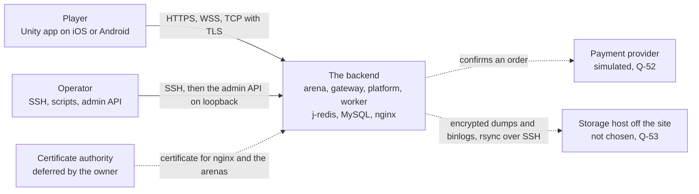
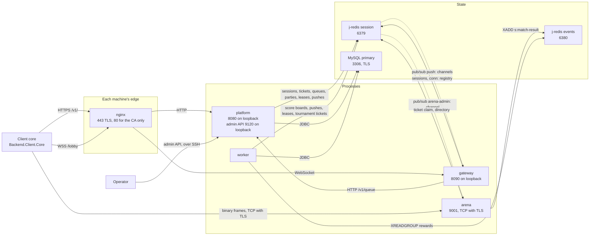
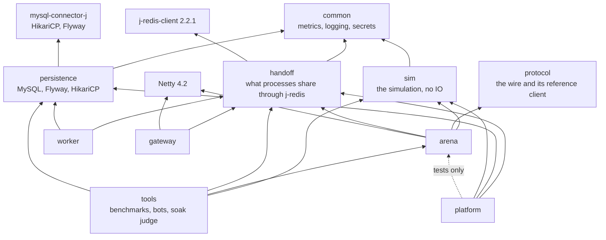
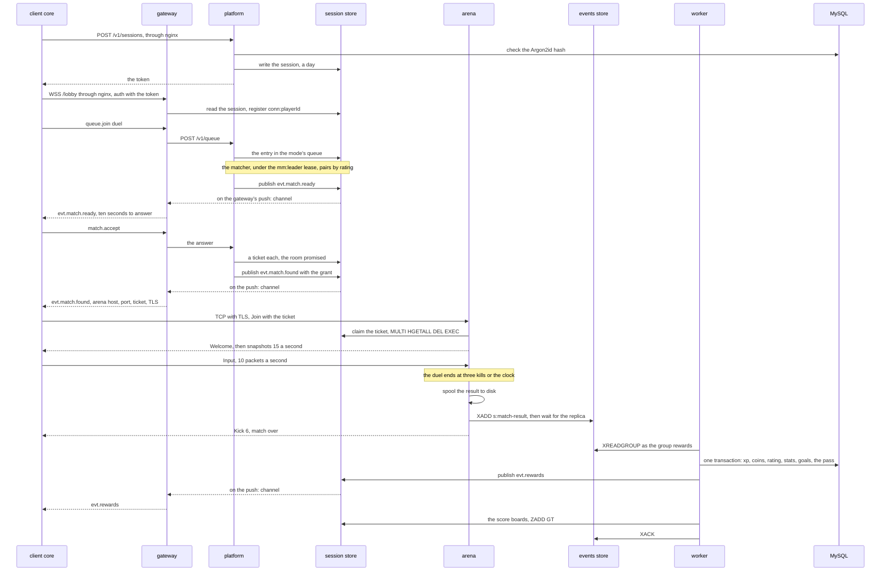
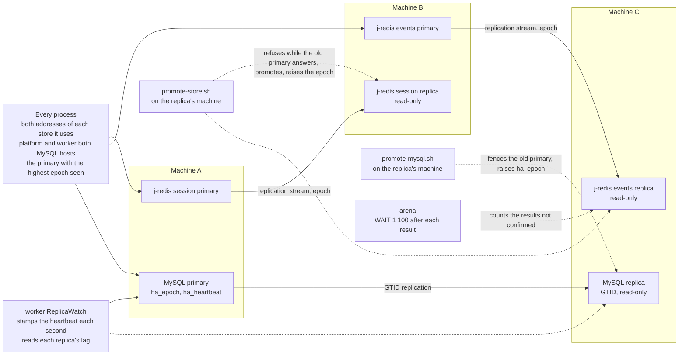
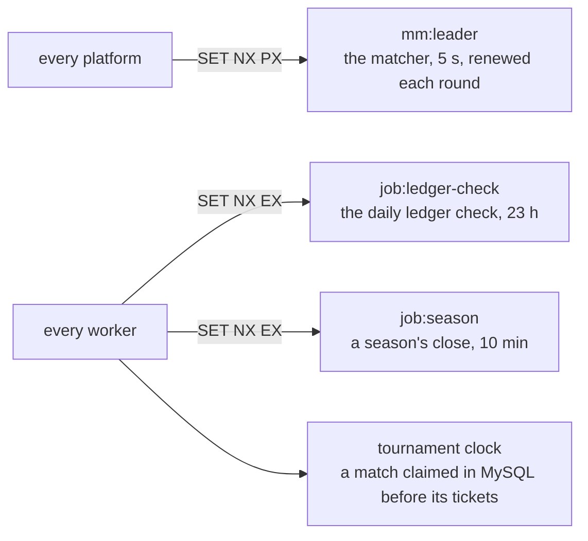

# 01 — The system

The backend drawn whole: who uses it, what runs, what each module depends on,
how a match goes from a login to its rewards, and how the stateful parts fail
over. The words are the [glossary](../glossary.md)'s; the reasons are in the
[topology](../architecture/01-system-topology.md), the
[availability model](../architecture/02-availability.md) and the
[decision log](../architecture/03-decision-log.md). Drawn from the code as of
2026-10-04.

## 1. System context

Who and what the backend meets. A player uses only the Unity app, whose
engine-free core (`Backend.Client.Core`) does all the talking; an operator
reaches the machines by SSH and `platform`'s admin API (`AdminServer`). The
payment provider is simulated (`PaymentService`, D-68), and the host for the
backups' copy off the site is not chosen yet (Q-53).

## 2. Containers

Every process and store, with what each speaks and the ports of the example
settings in `backend/deploy/env/` (all of them settings). Match traffic goes
straight to an arena, never through nginx or the gateway (D-5); the lobby and
the API go through nginx. Pushes and an operator's room commands are
published on the `session` store and reach the gateway and the arena by
pub/sub. Each process also serves Prometheus metrics on a loopback address
(`BACKEND_METRICS_ADDR`), not drawn.

## 3. Maven modules

What each module of `backend/` depends on, from its `pom.xml`. `arena` never
reaches MySQL: nothing it depends on brings a database driver, which is why
`handoff` exists. `platform` sees `arena` in its tests only.

## 4. From a login to the rewards

The main path, a queued duel. The classes: `AuthService` and `SessionStore`
(login), `LobbyHandler` and `ConnectionRegistry` (the lobby), `QueueService`,
`MatchQueue` and `Matchmaker` (queue, confirm step, tickets), `TicketStore`
and `RoomThread` (the join), `MatchResultPublisher` (the spool and the
stream), `MatchResultConsumer` and `MatchResultRepository` (the result), and
`LobbyPush` (every push). Each push goes on the channel of the gateway that
holds the player's connection, found by `conn:`.

## 5. High availability

### Primaries, replicas and promotion

The three stateful roles, each a primary with a replica on another machine, on
the three-machine layout of the topology. What runs where at launch on two
machines is still open (topology §2). Promotion is a script an operator runs
(D-8); an epoch only a promotion raises keeps every process off an old primary.
The classes and scripts: `StoreClients` and the j-redis client (the stores),
`PrimaryDataSource` (MySQL), `ReplicaWatch` (the heartbeat and the lag),
`MatchResultPublisher` (the wait for the `events` replica),
`promote-store.sh` and `promote-mysql.sh`.

### Leases

Jobs that one process of many must run are taken by a lease in the `session`
store, `SET NX` with an expiry, and given back when done. None carries a
fencing token: each job is safe to repeat (availability §5). The classes:
`Matchmaker`, `LedgerCheck`, `SeasonKeeper`; the tournament clock
(`TournamentScheduler`) runs in every worker and claims a match in MySQL
instead (D-41).

