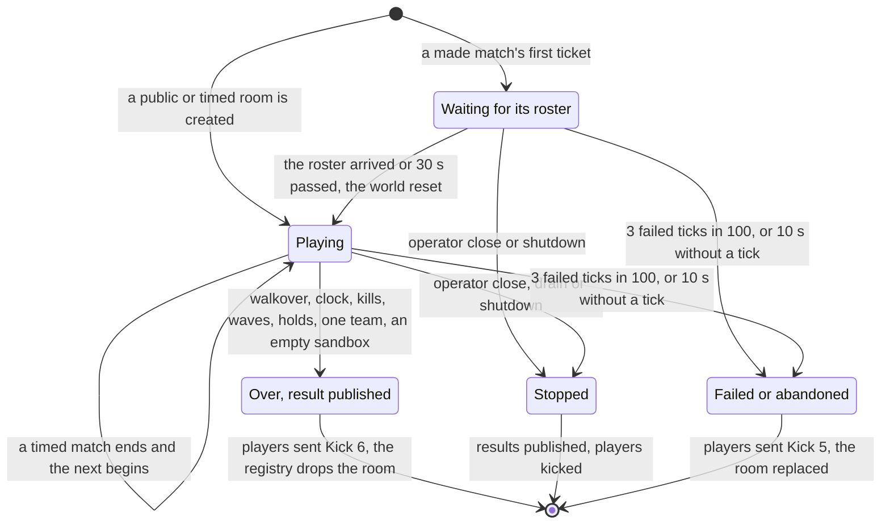
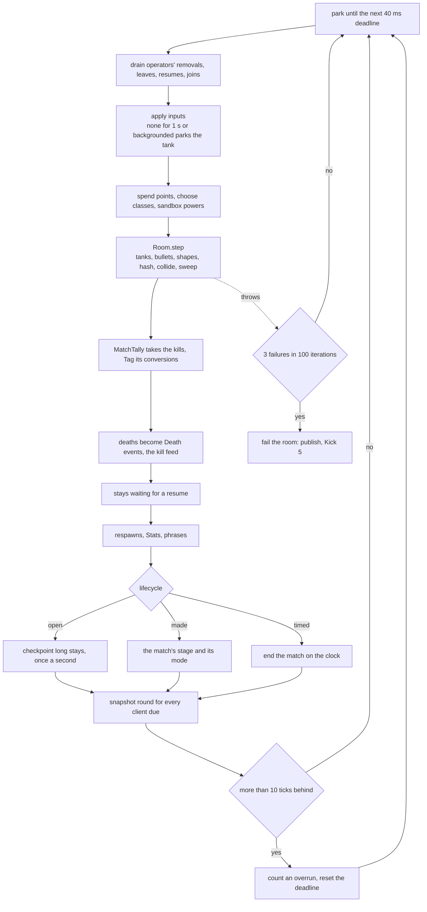
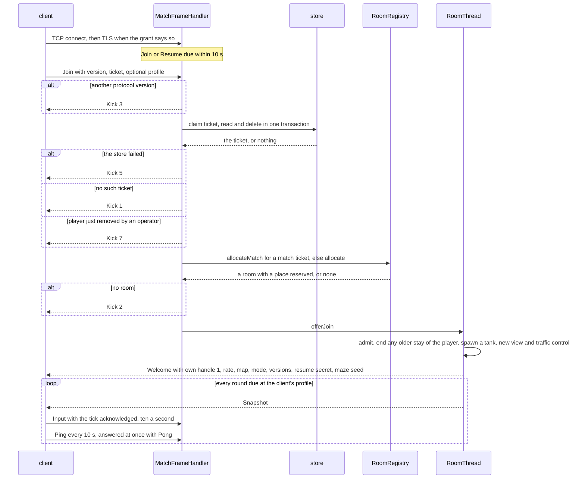
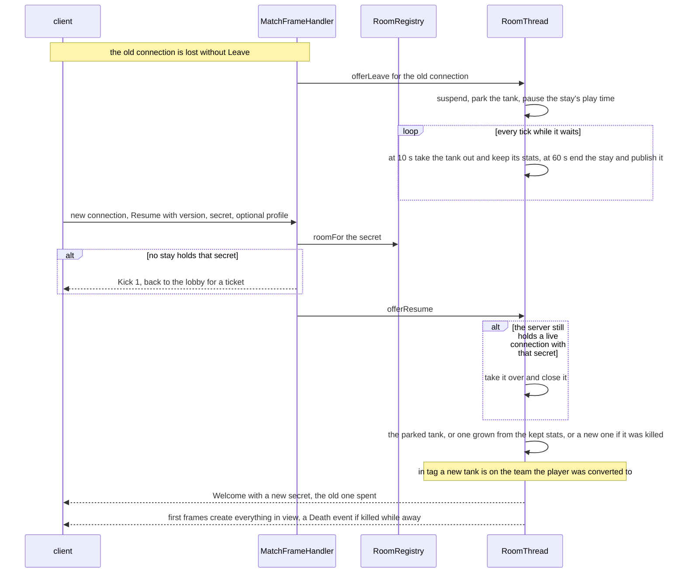
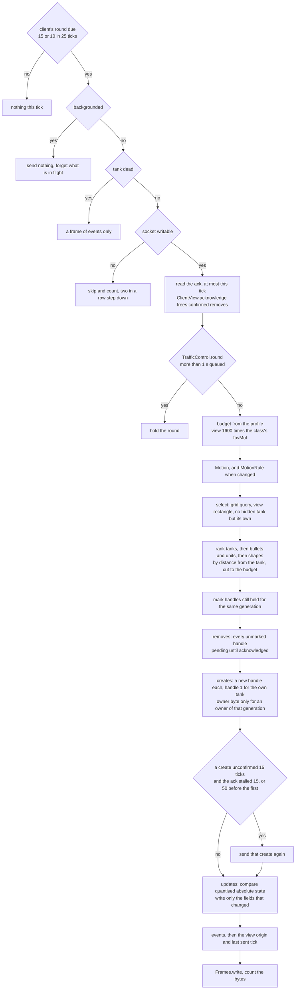
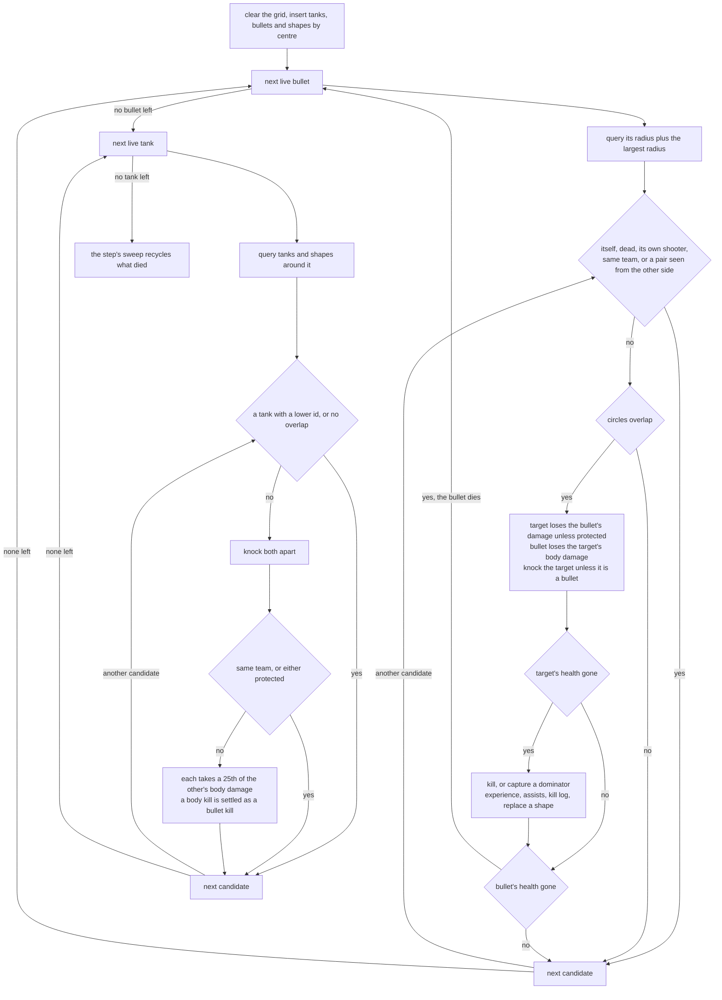
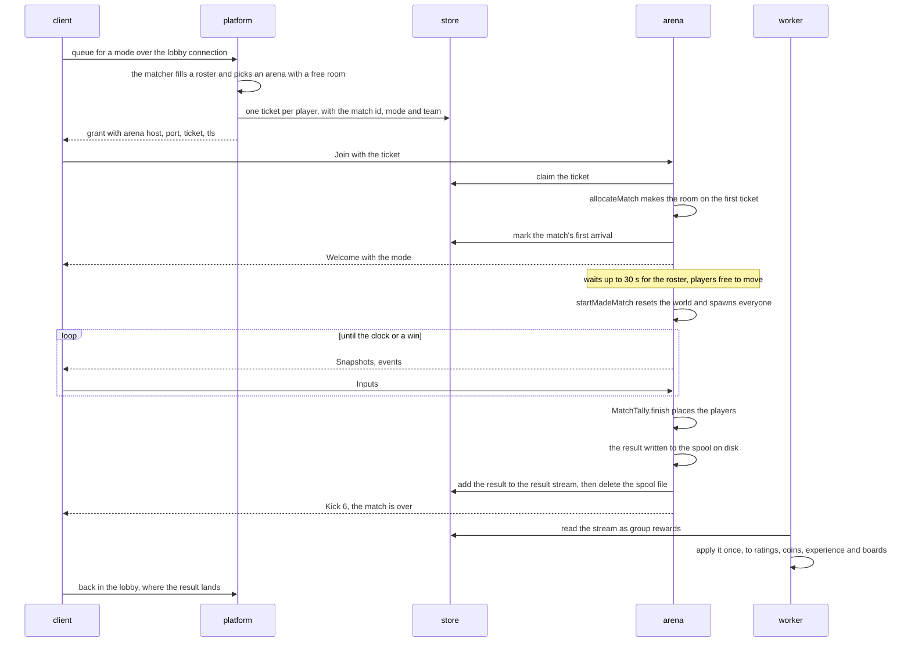
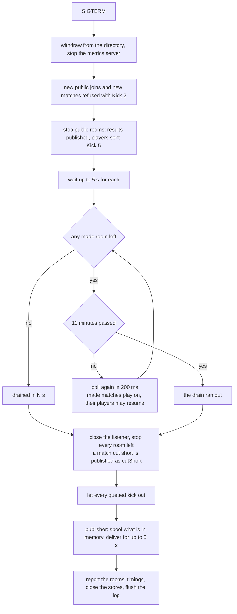

# Diagrams: the arena and the wire

How an arena runs its rooms and what crosses the match connection, drawn from
the code in `backend/arena`, `backend/sim` and `backend/protocol`. The design is
in [01 Realtime arena](../detailed-design/01-arena.md) and
[02 Networking](../detailed-design/02-networking.md); the modules' own pages are
[arena](../../backend/arena/README.md), [sim](../../backend/sim/README.md),
[protocol](../../backend/protocol/README.md) and
[tools](../../backend/tools/README.md).

## Room lifecycle

`RoomThread` holds a room's stage; `RoomRegistry` creates rooms, drops the
finished and failed ones, and its watchdog abandons a hung one. A public room
(`MatchRules.OPEN`) and a timed one stay in `Playing`; only a made match's room
waits for a roster and ends ([01 §8.1](../detailed-design/01-arena.md#81-the-mode-decides-the-lifecycle)).

## The tick loop

`RoomThread.run` keeps a 40 ms deadline and calls `RoomThread.tick`, which wraps
`Room.step`. The order is fixed: input before the step, everything that reads
the step's kills after it, the snapshots last
([01 §1](../detailed-design/01-arena.md#tick-loop)).

## Join, with the ticket claim and the Welcome

`MatchFrameHandler` reads the `Join` on the connection's event loop and claims
the ticket from j-redis without blocking it; `RoomRegistry` reserves a place, and
the room thread admits the player
([02 §3](../detailed-design/02-networking.md#3-messages),
[04 §3](../detailed-design/04-platform-services.md#3-arena-registry-rooms-and-tickets)).

## Resume after a lost connection

A connection that closes without `Leave` leaves its stay waiting. `RoomThread`
parks the tank, takes it out after 10 s keeping what it had grown into, and
ends the stay after 60 s; a `Resume` with the latest secret takes it back
([02 §10](../detailed-design/02-networking.md#10-session-reconnect-and-app-lifecycle)).

## Snapshot encoding

`RoomThread.sendSnapshots` decides whether a client's round goes out
(`TrafficControl`), and `SnapshotEncoder` writes it against that client's
`ClientView`: deltas against what was last sent, handles freed only once the
client acknowledges their removal
([02 §4, §5, §7, §8](../detailed-design/02-networking.md#4-the-snapshot)).

## Collision broadphase

`Room.rebuildHash` files every entity in one 200-unit cell by its centre, so
each query reaches the largest radius anything has. `Room.collide` settles each
bullet's hits first, then each tank's body contacts, every pair once
([01 §6](../detailed-design/01-arena.md#6-spatial-hash-and-collisions)).

## A made match, from grant to published result

The matcher in `platform` makes the match and its tickets; the arena makes the
match's room from its first ticket (`RoomRegistry.allocateMatch`, D-20),
`RoomThread` plays it, and `MatchResultPublisher` hands the result to the
workers through the stream `s:match-result` ([04 §4](../detailed-design/04-platform-services.md#4-matchmaking),
[01 §8](../detailed-design/01-arena.md#8-match-modes)).

## Draining an arena

`ArenaMain`'s shutdown hook stops an arena in this order: no new players, the
public rooms ended at once, the made matches played out, then everything
published ([01 §8.6](../detailed-design/01-arena.md#86-draining-an-arena-designed-2026-09-29-plan-item-7)).

## The wire, message by message

Every frame is `varint length, payload` of at most 8 KiB, the payload's first
byte its type; little-endian except the two big-endian `u32`s. Constants are in
`protocol/Wire` and `protocol/ClientMessage`, mirrored in `client/Core/Wire.cs`;
protocol version 4 ([02 §2–§4](../detailed-design/02-networking.md#2-primitives)).

| Direction | Id | Message | Payload | When |
|---|---|---|---|---|
| client → arena | 1 | `Join` | `u8 version, string ticket, [u8 profile]` | once, within 10 s of connecting |
| | 2 | `Input` | `varint seq, varint ackTick, u8 move, u16 aim, u8 flags` | ten a second while alive and in the foreground |
| | 3 | `UpgradeStat` | `u8 stat` | on tap |
| | 4 | `ChooseClass` | `u8 classId` | on tap |
| | 5 | `Respawn` | none | on tap, while dead |
| | 6 | `Phrase` | `varint phraseId` | at most one per 2 s |
| | 7 | `Ping` | `u32 clientTimeMs`, big-endian | every 10 s in every state |
| | 8 | `Lifecycle` | `u8 state`, 0 foreground, 1 background | on a change |
| | 9 | `Leave` | none | once, then wait for the arena's close |
| | 10 | `Resume` | `u8 version, string secret, [u8 profile]` | in place of `Join` after a lost connection |
| | 11 | `Sandbox` | `u8 action, varint value` | in a sandbox only |
| arena → client | 1 | `Welcome` | `u8 selfHandle, u8 snapshotHz, varint mapW, mapH, u8 mode, varint contentVersion, phraseListVersion, selfEntityId, string resumeSecret, varint mazeSeed` | after a join or a resume |
| | 2 | `Snapshot` | `tickDelta, inputSeqDelta, origin delta`, removes, creates, updates, events | 15 or 10 a second |
| | 3 | `Pong` | `u32 clientTimeMs`, big-endian, `varint serverTick` | for each `Ping` |
| | 4 | `Kick` | `u8 reason` | then the arena closes |

Every event is `u8 type, varint length, payload`, so a client steps over a type
it does not know. A `name` below is `u8 length` and its UTF-8 bytes, empty for
nobody or past 64 bytes.

| Snapshot event | Id | Payload | To |
|---|---|---|---|
| `Death` | 1 | `varint score, name killer` | the player who died |
| `Stats` | 2 | `varint level, xp, xpForNext, u8 unspent, u8[8] points` | the player, on a change, experience alone at most once a second |
| `Phrase` | 3 | `u8 handle, varint phraseId, name speaker` | the speaker's team, or those whose view holds the speaker |
| `Kill` | 4 | `name killer, name victim` | the killer; in a made match everyone |
| `Motion` | 5 | `u8 inputTicks, svarint vx, vy` | the player, every frame while alive |
| `MotionRule` | 6 | `f32 accel, f32 radius`, big-endian bits | the player, when either changes |
| `Skin` | 7 | `u8 handle, u8 skin` | with the create of a tank that has a skin |

| Kick | Meaning | Client's answer |
|---|---|---|
| 1 | ticket or resume secret unknown, used or expired | back to the lobby for a ticket |
| 2 | no room | queue again |
| 3 | protocol version | update the app, never retry |
| 4 | rate limit | a client bug, log it |
| 5 | the server's fault, or the arena stopping | retry with backoff |
| 6 | the made match is over | back to the lobby |
| 7 | removed by an operator | back to the lobby |
