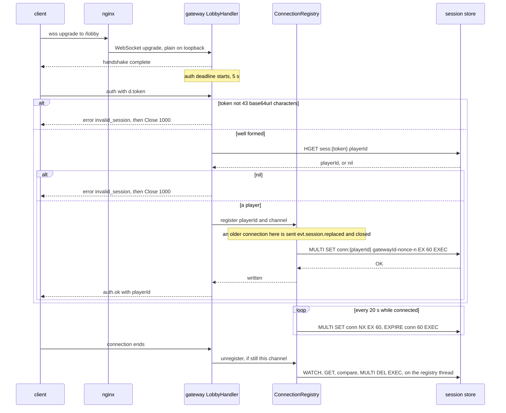
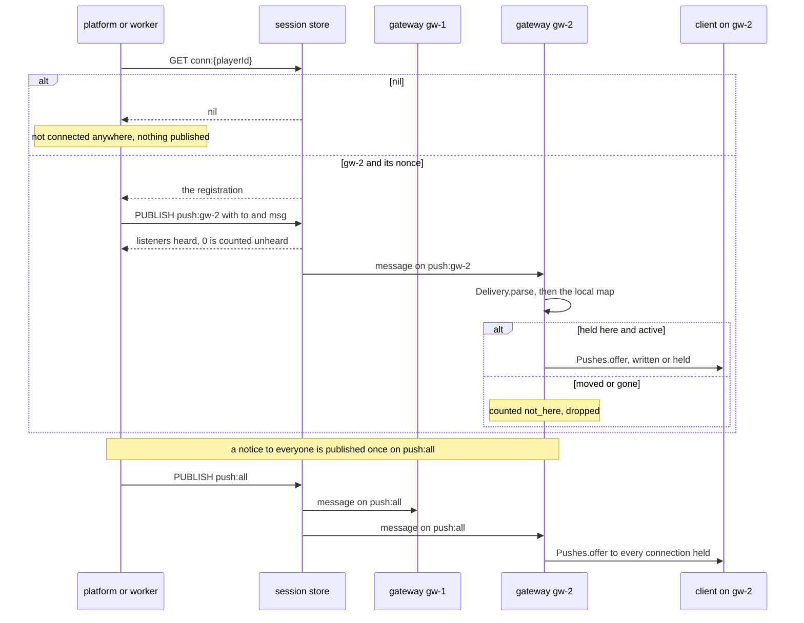
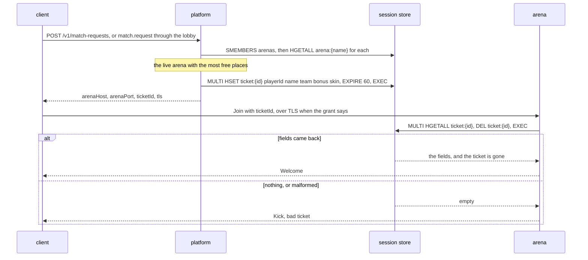
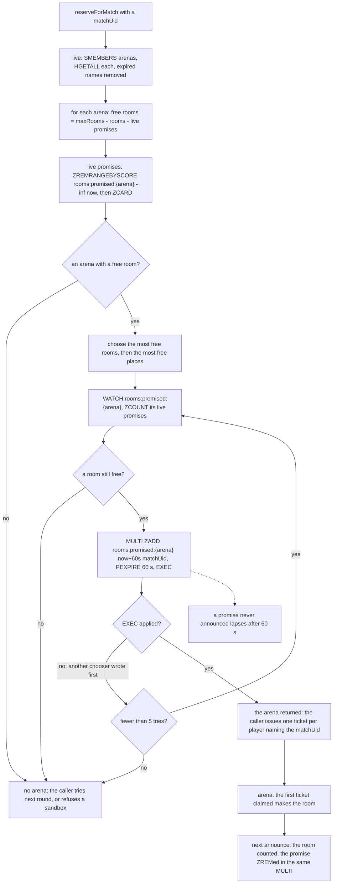
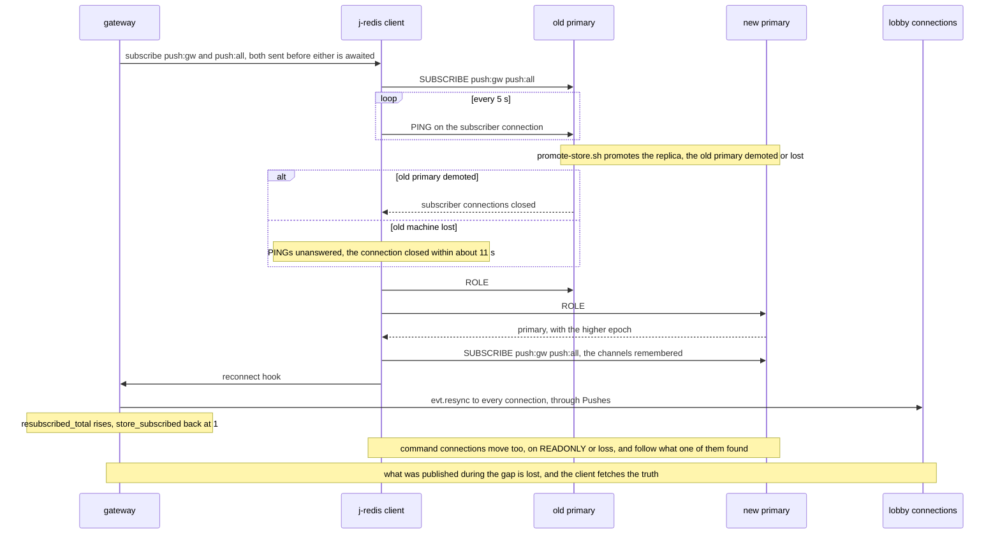
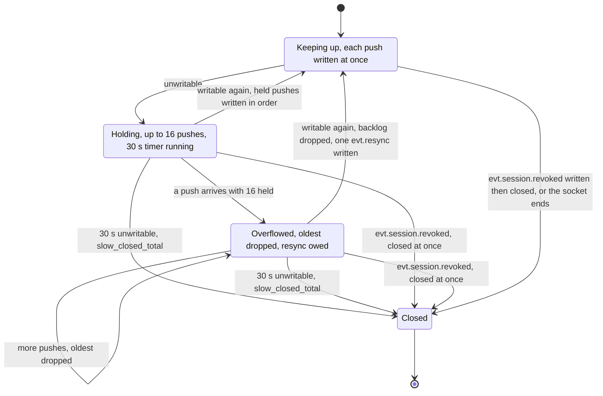
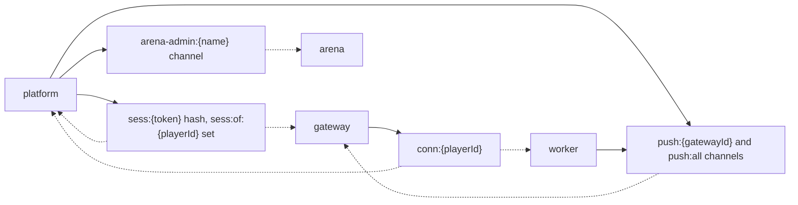
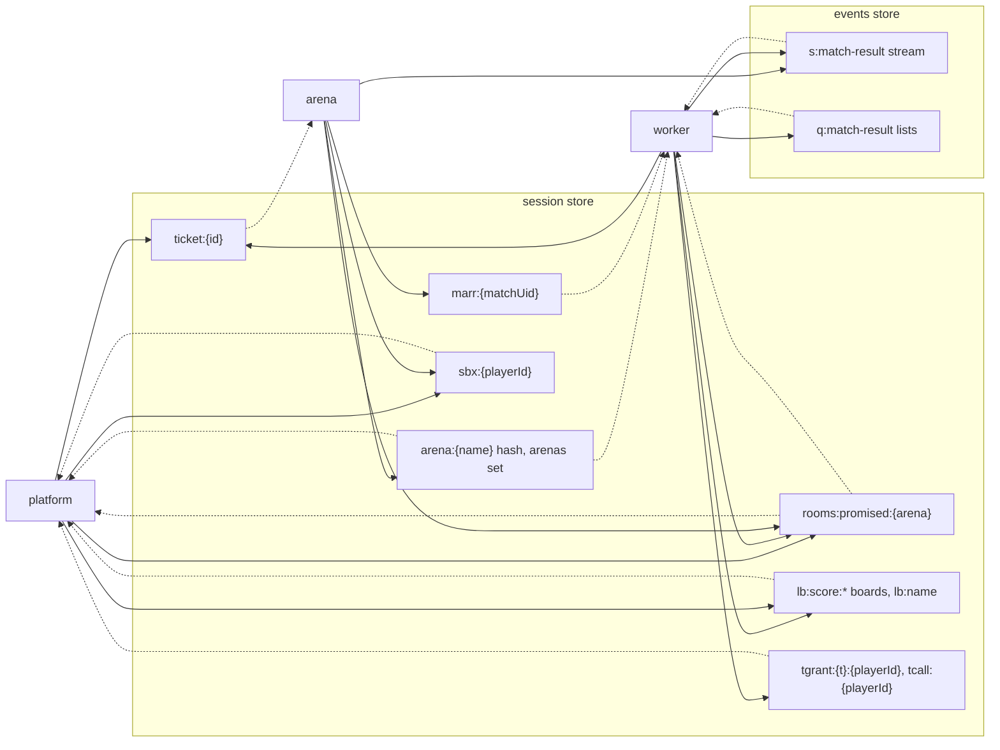

# Diagrams — the lobby and the store

The flows of the lobby connection and of what the processes hand each other through the store
(j-redis), as built. The design is [03 — Gateway](../detailed-design/03-gateway.md) and
[04 — Platform services](../detailed-design/04-platform-services.md). The references are the
READMEs of [gateway](../../backend/gateway/README.md), [handoff](../../backend/handoff/README.md)
and [common](../../backend/common/README.md).

## Lobby connect and auth

`LobbyHandler` takes the handshake and the `auth` message, `SessionStore.playerIdOf` reads the
session, and `ConnectionRegistry` writes the registration that pushes are routed by
([03 §4](../detailed-design/03-gateway.md#4-connection-lifecycle)). `auth.ok` waits for that
write, so a push sent the moment it arrives finds the player.

The value written is `{gatewayId}#{nonce}-{n}`; the diagram writes the `#` as a dash, since a
diagram label cannot carry it.

## Push routing across gateways

`LobbyPush.send` looks up the registration and publishes on the channel of the gateway named
before its `#`. The gateway's subscription (`GatewayServer.listenForPushes`) hands the message to
`ConnectionRegistry.deliver`, which passes it to the connection's `Pushes` on that connection's
event loop ([03 §5](../detailed-design/03-gateway.md#5-push-routing)).

## Ticket issue and claim

`platform`'s `JoinService` picks an arena from `ArenaDirectory` and issues the ticket with
`TicketStore.issue`. The arena's `MatchFrameHandler` claims it with `TicketStore.claim`, off its
event loop ([04 §3](../detailed-design/04-platform-services.md#the-join-ticket)). A made match's
tickets are issued the same way, after a room is reserved (next diagram).

## Room reservation for a made match

`ArenaDirectory.reserveForMatch` is called by `platform`'s matcher (`Matchmaker.make`) and sandbox
opener (`QueueService`), and by `worker`'s `TournamentScheduler`. The promise keeps matches chosen
between two announcements from all going to an arena's last room
([D-42](../architecture/03-decision-log.md#d-42--a-matchs-room-is-promised-in-the-store-when-its-arena-is-chosen)).

## Store failover, the subscriber following the primary

`StoreClients.open` gives the gateway a j-redis client that knows both addresses of the session
store. `GatewayServer.listenForPushes` subscribes to both channels and registers the reconnect
hook, which tells every connection to resynchronise through `ConnectionRegistry.resync`
([03 §5](../detailed-design/03-gateway.md#when-the-subscription-is-lost-designed-2026-10-01-plan-item-50),
[runbook §2](../operations/02-runbook.md#a-j-redis-store-built-2026-09-29-d-34)).

## Slow-client backpressure

Each connection's `Pushes` holds pushes while Netty reports the connection unwritable (more than
64 KiB waiting to go out), and closes it after 30 s
([03 §8](../detailed-design/03-gateway.md#8-backpressure-and-slow-clients)). Replies to the
client's own requests do not pass through the ring.

Each spell from unwritable to writable or closed is timed into
`backend_gateway_unwritable_seconds{end}` (`drained` or `closed`).

## Who writes and reads each key family

In both diagrams below, a solid arrow writes or publishes and a dotted arrow reads or subscribes.
The full table, with types and lifetimes, is in
[handoff's README](../../backend/handoff/README.md#store-key-families).

### Sessions, the lobby and the operator's channels

`SessionStore`, `LobbyPush`, the gateway's `ConnectionRegistry`, and `ArenaDirectory`'s operator
channel. All of them are on the session store.

### Matches and their results

`TicketStore`, `ArenaDirectory`, `SandboxHolds`, `TournamentGrants`, `MatchArrivals` and
`LeaderboardStore` are on the session store. `MatchResultStream` and `MatchResultQueue` are on the
events store.

Two arrows need a word:
- **`rooms:promised:{arena}`:** the arena only removes promises, in its announcement.
- **`s:match-result`:** a worker writes to it only when it moves the old list inbox into it.
