# Diagrams: platform

The flows of [04 — Platform services](../detailed-design/04-platform-services.md), drawn from the
code in `backend/platform` (and, where a flow continues there, `handoff`, `persistence` and
`worker`). Every route, answer and refusal named here is listed in the
[platform README](../../backend/platform/README.md).

## Register and log in

`PlatformHttpServer.register` and `login`, `PasswordHasher.admit`, `LoginThrottle.attempt`,
`AuthService.register` and `login`, `handoff/SessionStore.open`. Every check that can refuse runs
before Argon2, so a refusal costs no hash; a refusal for load is answered before anything is
counted.

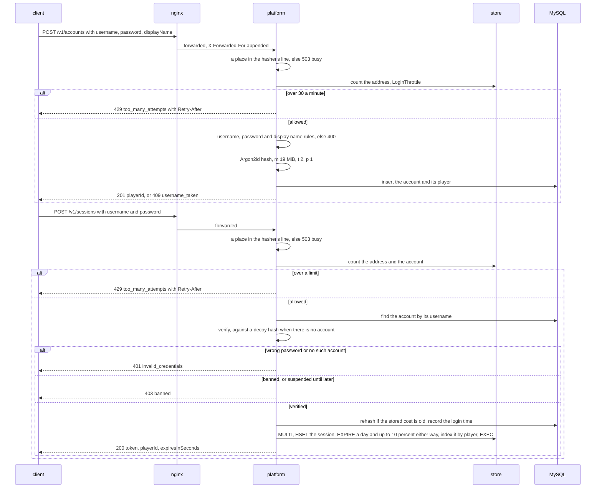

## Guests and the upgrade

`AuthService.createGuest`, `loginGuest` and `upgrade`; `persistence/AccountRepository.createGuest`,
`findGuest`, `upgradable` and `upgrade`. A guest's key is never stored, only its SHA-256, and its
login hashes nothing slow.

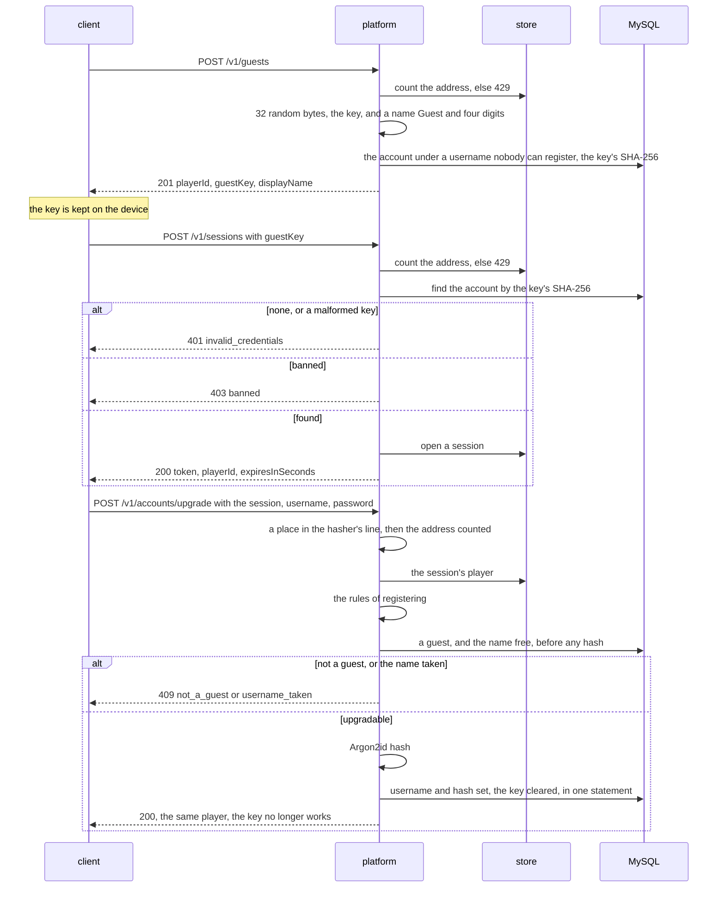

## A seat in the public arena

`JoinService.requestJoin`, `EquipmentService.bonusOf` and `skinOf`, `handoff/ArenaDirectory.pick` and `promiseSeat`
and `TicketStore`; the arena claims the ticket in `MatchFrameHandler`. The ticket carries
everything the arena needs, so the arena never reads MySQL.

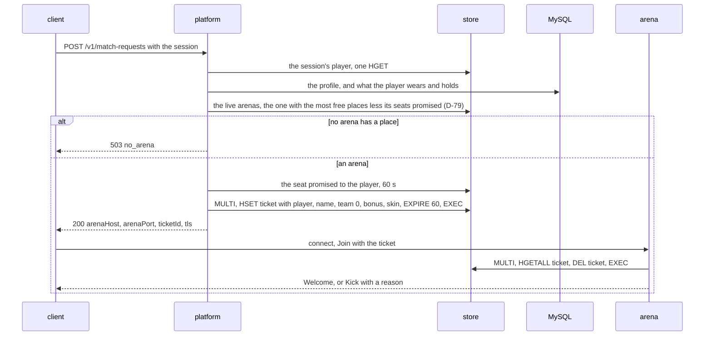

## The queue and the confirm step: a player's record

`MatchQueue`'s record of a player, `mmp:{playerId}`, which decides whether they are queued, asked
or matched; each move is one watched transaction (D-55). The record expires, which returns a
player stuck by a crash to none.

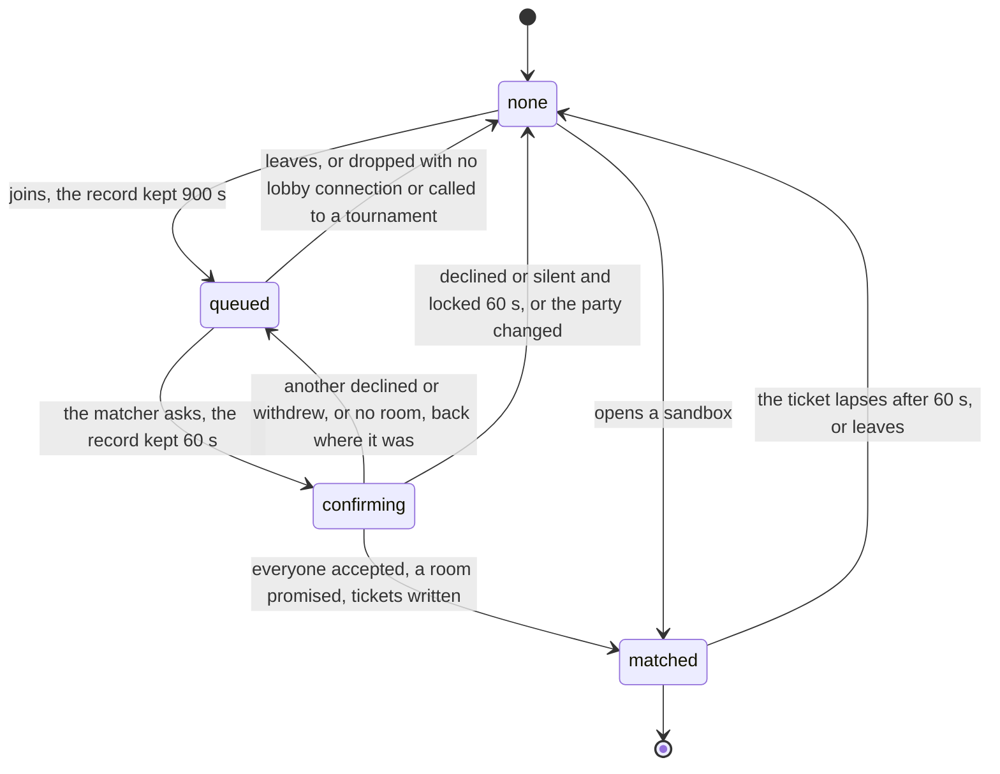

## The queue and the confirm step: a round

`QueueService.join` and `answer`, `Matchmaker.round`, `settle`, `match`, `lineups`, `make` and
`callOff`, and `MatchQueue.join`, `ask`, `answer`, `make` and `end`. Only the platform holding
`mm:leader` runs the round; a step overtaken by another writes nothing, and the next round reads
again.

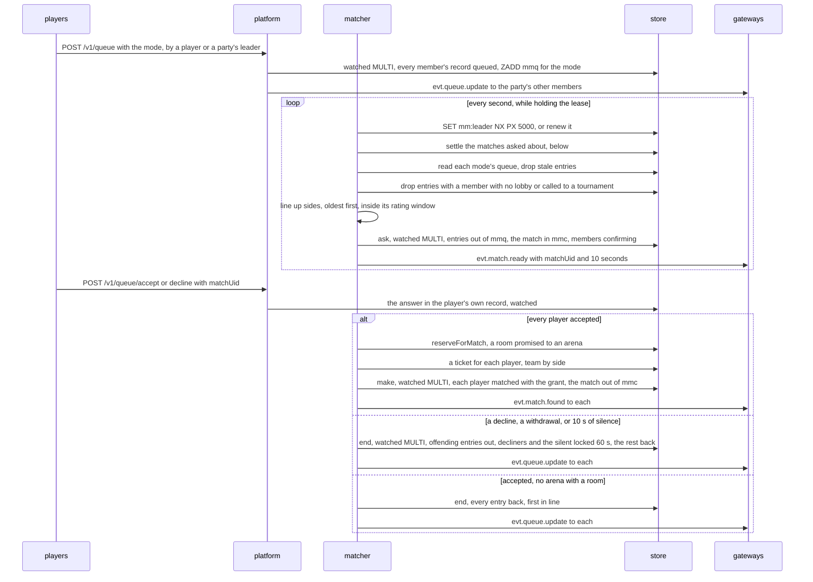

## A party, its versions

`PartyService` and `Parties`; the client keeps the newest state by `PartyState` (D-74). Each change
reads what it depends on under a watch and writes in one transaction, its version one more; an
answer and a push may arrive in either order, and the client applies only another party or a
higher version.

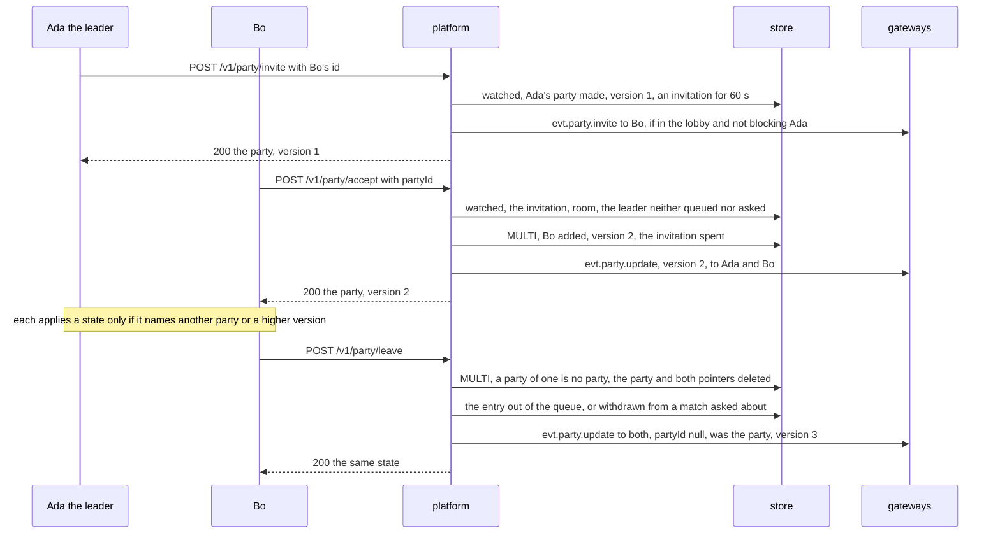

## A team action

`TeamService` and `persistence/TeamRepository`. Each action is one MySQL transaction that locks the
team first, then the players it changes (D-39); the pushes follow the commit, and a refusal tells
nobody.

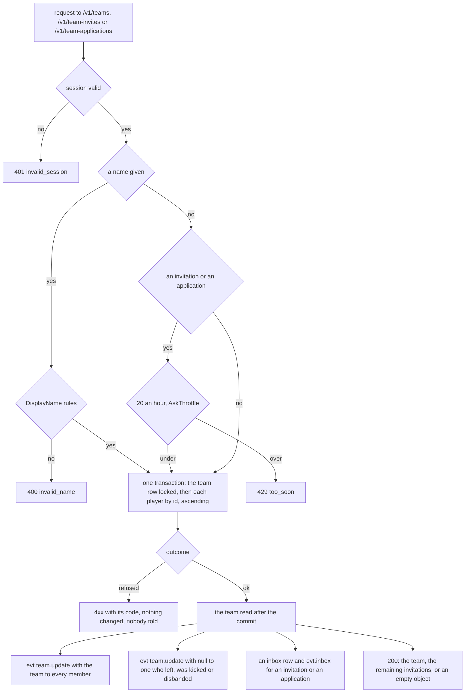

## A tournament

`persistence/TournamentRepository` holds the state; `worker/TournamentScheduler` moves it every
5 s, each move a conditional update on the state and version, so two workers cannot move it twice.
`POST /admin/tournaments` creates it; players enter while it registers.

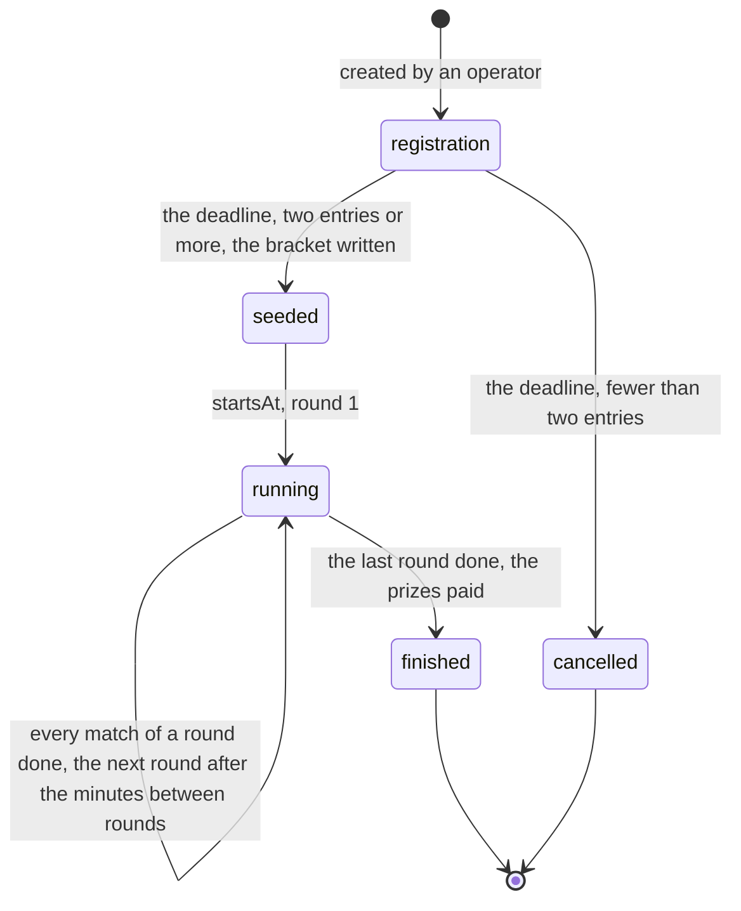

## A tournament match

A match of the bracket, in `TournamentScheduler.make` and `settle`. A match nobody came to is
decided 270 s after its tickets; one somebody came to waits for its result up to 30 minutes
(`marr:{matchUid}`).

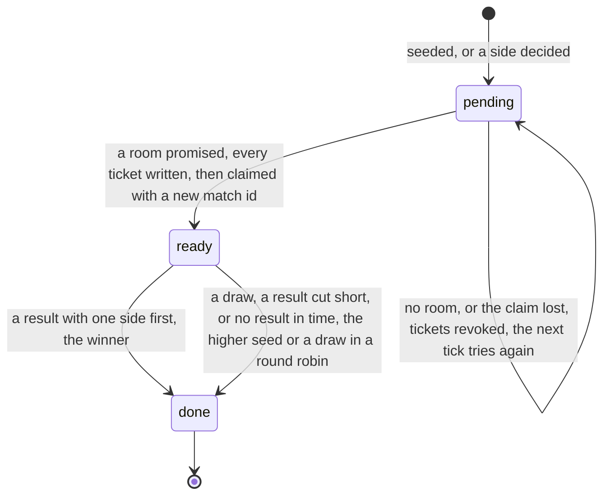

## The scheduler's round

`TournamentScheduler.tick`, `step`, `run`, `make`, `settle` and `over`. The grant is kept for the
ticket's 60 s (`tgrant:`), and the player called (`tcall:`), which the queue reads as a match.

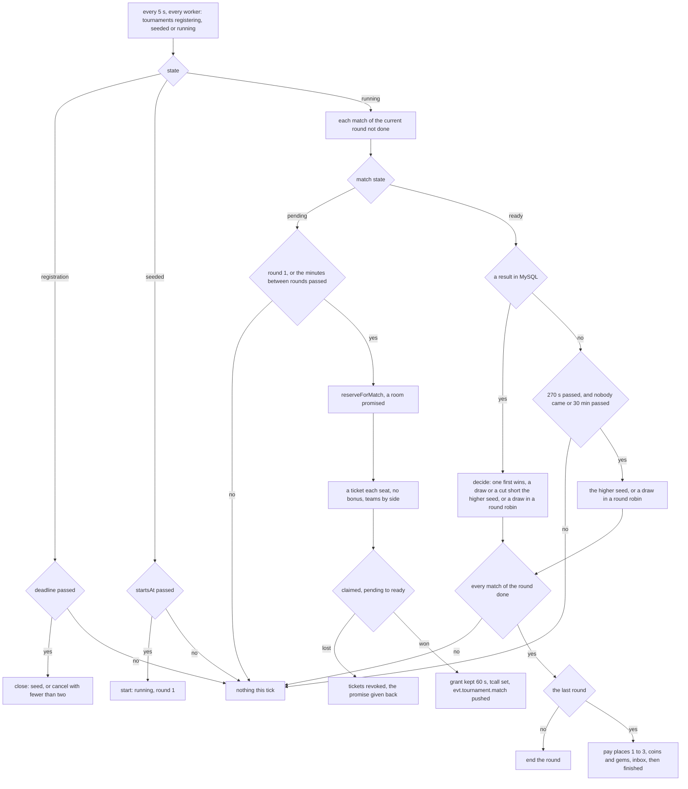

## A simulated payment order: its states

`persistence/PaymentRepository`: an order moves only forward, each step under its row's lock.
`worker`'s retention expires what waited a day.

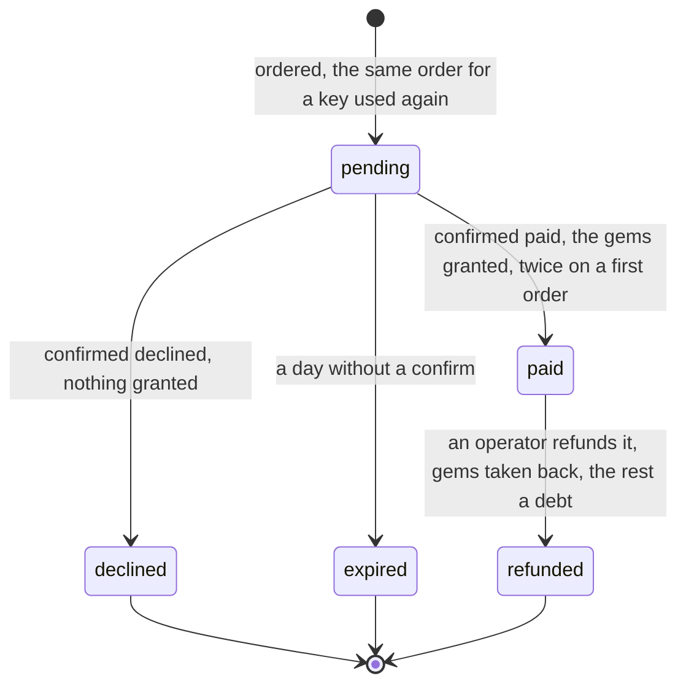

## A simulated payment order: the calls

`PaymentService`, `persistence/PaymentRepository` and `AdminRepository.refund` and `clearDebt`.
Every payment route answers 503 `payments_off` unless `BACKEND_PAYMENT_PROVIDER=simulated`.

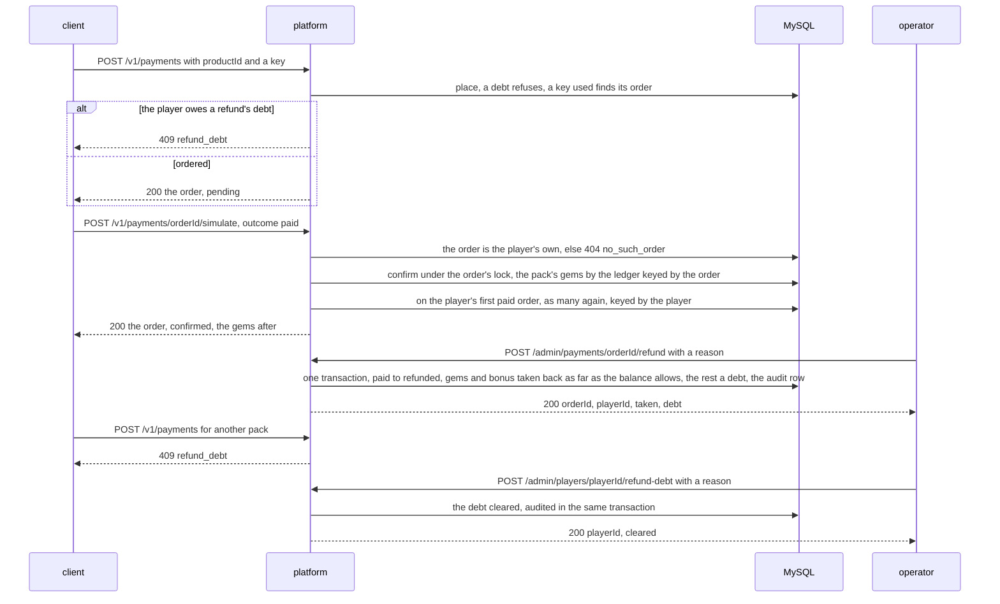

## The season pass crossing tiers

`persistence/SeasonPassRepository.earn`, `pay` and `buyPremium`, the table in `SeasonPass`. Points
are earned in `worker`'s result transaction; premium is bought through `platform`. A track's mark
moves with what it paid, so each tier pays once.

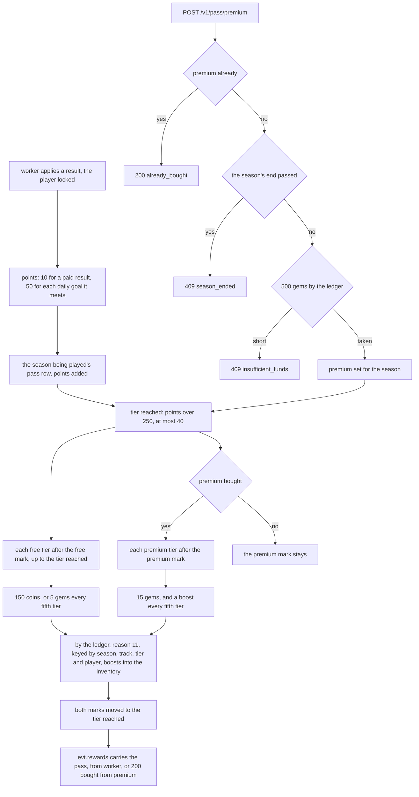

## Buying, wearing and boosting

`ShopService.buy`, `EquipmentService.wear` and `bonusOf`, `BoostService.activate`, with
`persistence/EconomyRepository`, `EquipmentRepository` and `BoostRepository`. Each key is the
client's, made once a tap and sent with every retry, so a retry is answered as the first attempt
was.

```mermaid
flowchart TD
    subgraph buy ["POST /v1/purchases"]
        B1["sku and key"] --> B2{"key 16 to 48 of a-z, 0-9 and hyphen"}
        B2 -->|no| B3["400 invalid_key"]
        B2 -->|yes| B4{"key used before"}
        B4 -->|yes| B5["200 already_bought, what it bought"]
        B4 -->|no| B6{"offer known and on sale"}
        B6 -->|no| B7["404 unknown_sku or 409 not_available"]
        B6 -->|yes| B8{"account level high enough"}
        B8 -->|no| B9["403 level_required"]
        B8 -->|yes| B10{"one transaction, the player locked, coins or gems by the ledger"}
        B10 -->|short| B11["409 insufficient_funds"]
        B10 -->|done| B12["200 bought, the balance and how many held"]
    end
    subgraph wear ["PUT /v1/equipment/slot"]
        W1["itemId"] --> W2{"slot and item known, the item for that slot"}
        W2 -->|no| W3["400 invalid_slot, 404 unknown_item or 409 wrong_slot"]
        W2 -->|yes| W4{"held"}
        W4 -->|no| W5["409 not_owned"]
        W4 -->|yes| W6["worn, 200 the loadout, the bonus capped at 25 a stat"]
        W6 --> W7["the next ticket carries the bonus and the skin"]
    end
    subgraph boost ["POST /v1/boosts"]
        X1["itemId and key"] --> X2{"key valid, item a boost"}
        X2 -->|no| X3["400 invalid_key or 404 unknown_item"]
        X2 -->|yes| X4{"one held, no other of its kind running"}
        X4 -->|no| X5["409 not_owned or other_running"]
        X4 -->|yes| X6["one taken, it runs, or the same item's minutes added, 200 activated"]
        X6 --> X7["worker raises a match's xp or coins if it ended while the boost ran"]
    end
```

## An operator's ban, kick and notice

`net/AdminServer.player`, `kickEverywhere` and `notice`; `persistence/AdminRepository`;
`handoff/SessionStore.revokeAll`, `LobbyPush` and `ArenaDirectory.command`. Every call is checked
against the secret and audited, refusals included.

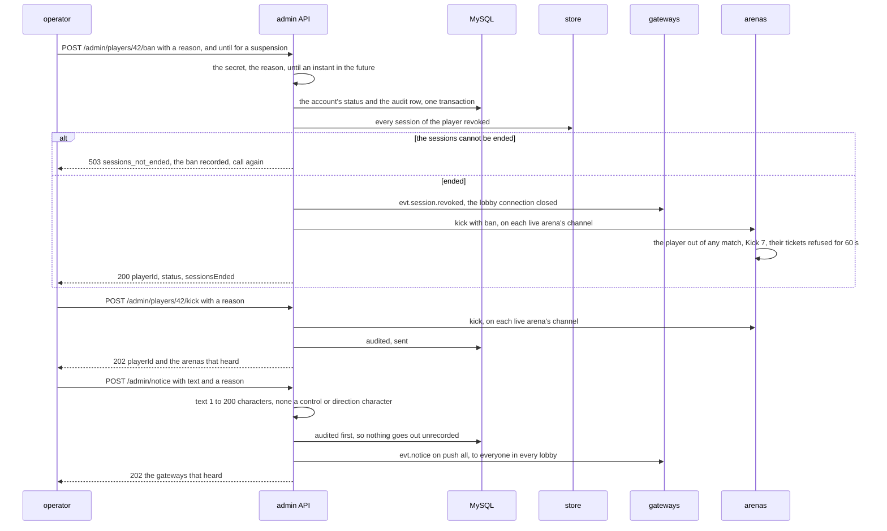
