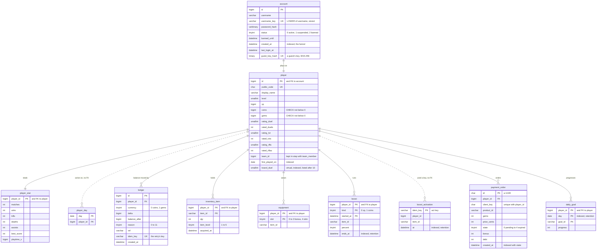
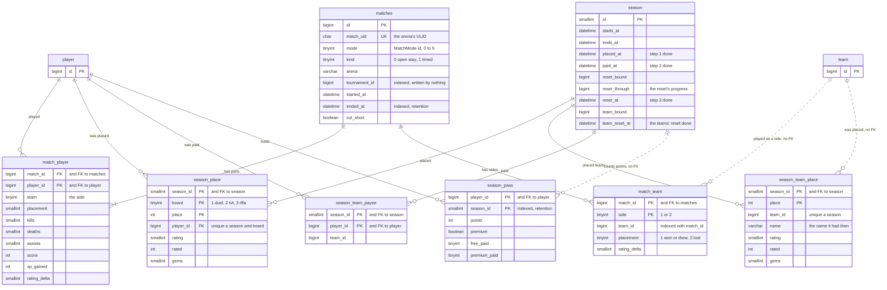
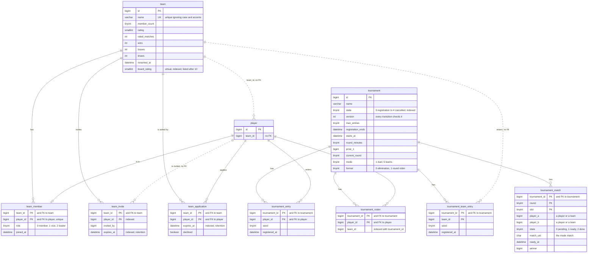
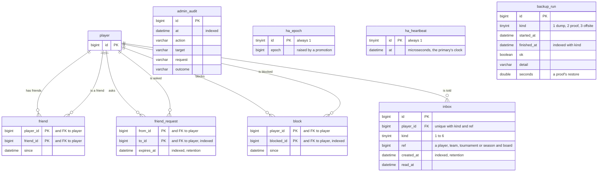
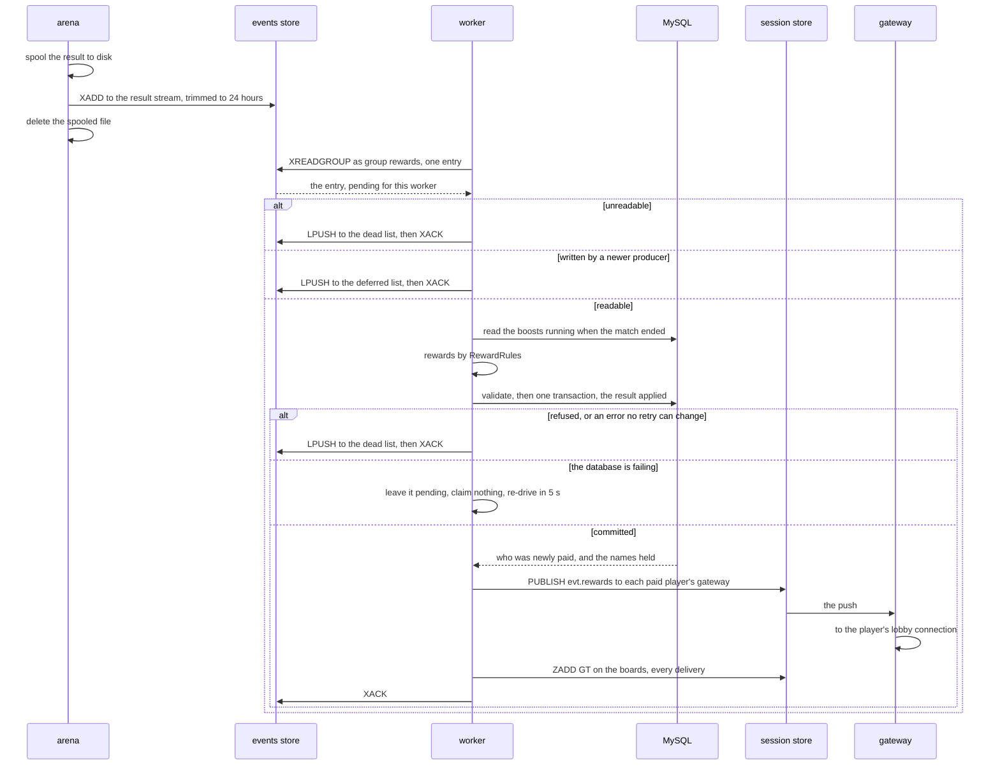
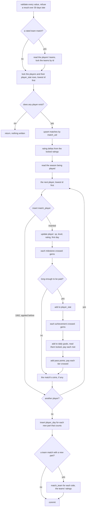
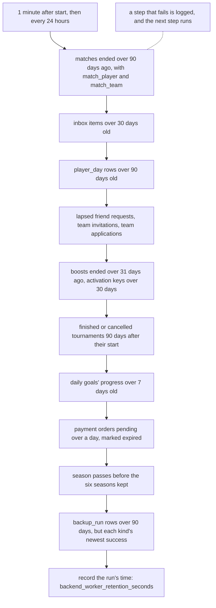
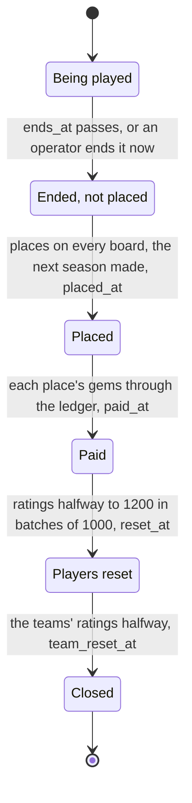
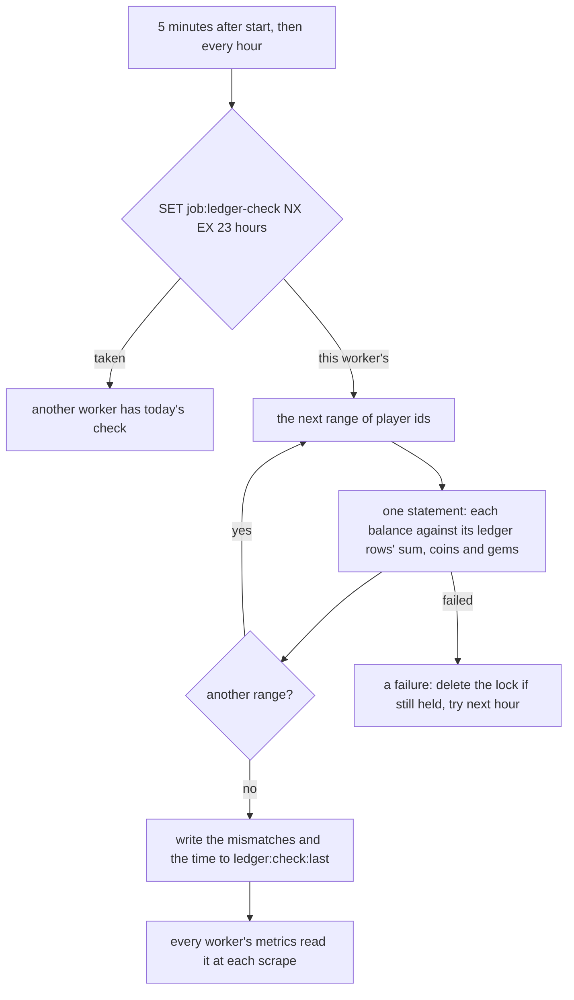
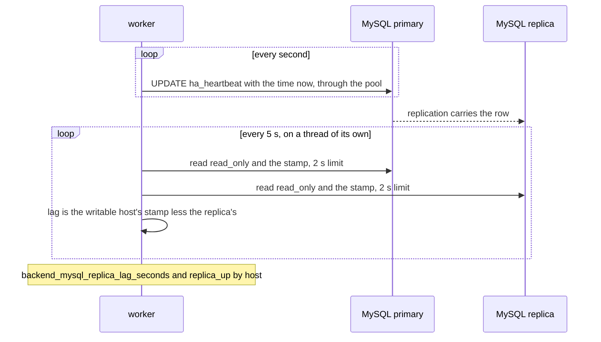

# Diagrams: data and worker

The tables of [06 — Persistence](../detailed-design/06-persistence-mysql.md) and the flows of
[05 — Worker and events](../detailed-design/05-worker-and-events.md), drawn from the schema,
`backend/persistence/src/main/resources/db/migration/V1__schema.sql`, and the code in
`backend/persistence` and `backend/worker`. The classes and every number named here are in the
[persistence README](../../backend/persistence/README.md) and the
[worker README](../../backend/worker/README.md).

## The tables

Thirty-six tables in four drawings, each table drawn once with its keys and the columns that say
what it is; [06 §3](../detailed-design/06-persistence-mysql.md#3-schema) has every column. A
solid line is a foreign key. A dashed line is a reference the schema does not enforce, on
purpose: a disbanded team's rows stay, and `player_day` and `boost_activation` spare their
inserts the check. `player` and `team` are repeated, with their key only, where another drawing's
tables point at them.

### Identity and economy

`account`, `player` and the tables that hang off a player's balances and belongings. Every
balance moves only through `ledger` (`EconomyRepository.move`).

### Match history and seasons

What a result writes and what a season's close keeps. `match_player`'s key is the result's
duplicate check; `season_place` and `season_team_place` are a past season's boards.

### Teams and tournaments

A team's members, invitations and applications, and a tournament's entries, rosters and
bracket. `tournament_match` holds players' ids, or teams' in a teams' tournament (mode 5), so
its sides and winner have no foreign key.

### Social and operations

Friendships, requests, blocks and the inbox; and the four tables operations write: the admin
API's audit, the failover epoch, the replica heartbeat and the backup steps' outcomes. The last
four point at nothing.

## The result pipeline

From a match's end to the player's screen ([05 §3](../detailed-design/05-worker-and-events.md#3-the-consumer-loop),
§6): the arena's `MatchResultPublisher`, `handoff/MatchResultStream`, `worker/MatchResultConsumer`,
`persistence/MatchResultRepository`, `handoff/LobbyPush` and `LeaderboardStore`. The entry is
acknowledged only after the commit, so a crash anywhere before it delivers it again, and the
apply recognises the redelivery.

The stream's key is `s:match-result`; the dead and deferred lists are `q:match-result:dead` and
`q:match-result:deferred`. An entry another worker left pending for a minute is taken over with
`XAUTOCLAIM` at the next re-drive.

## One result's transaction

`MatchResultRepository.apply`, in order, all in one transaction under the players' locks
([06 §4](../detailed-design/06-persistence-mysql.md#4-the-three-transactions-that-matter)). Every
payment goes through the ledger's one path under a key of its own, so nothing is paid twice.

## Retention

`worker/Retention`, in every worker, a minute after start and then every 24 hours, 1 000 rows a
transaction ([06 §9](../detailed-design/06-persistence-mysql.md#9-growth-and-retention)). Each step
stands on its own: one that fails is logged and the next still runs.

## The season's close

`worker/SeasonKeeper` each minute, under the store's lock `job:season`, which it extends while a
close runs; `persistence/SeasonRepository` writes each step and stamps it in the season's row
([D-63](../architecture/03-decision-log.md#d-63--a-season-ends-in-three-steps-each-safe-to-repeat-its-places-its-gems-then-its-reset)).
A run that stops part-way leaves the row where it stopped, and the next run goes on from there.

## The ledger check

`worker/LedgerCheck` in every worker, once a day across the fleet, and
`EconomyRepository.reconcile` ([05 §9](../detailed-design/05-worker-and-events.md#9-scheduled-work)).
The lock needs no fencing token: the check only reads.

## The replica's heartbeat and lag

`worker/ReplicaWatch` with `persistence/Database.heartbeat` and `PrimaryDataSource.replicaLags`
([06 §10](../detailed-design/06-persistence-mysql.md#10-backup-and-recovery),
[D-58](../architecture/03-decision-log.md#d-58--a-replica-is-measured-by-what-it-has-applied-a-heartbeat-for-mysql-the-primarys-own-account-for-the-stores)).
Both stamps are the primary's clock, so the two machines' clocks never meet.

