# 06 — Client diagrams

The client's core and its Unity layer, drawn from the code in
[`client/`](../../client/README.md). The design is
[08-client](../detailed-design/08-client.md); the protocol the core speaks is
[02-networking](../detailed-design/02-networking.md), the lobby's
[03-gateway §3](../detailed-design/03-gateway.md#3-lobby-protocol).

## 1. The core's structure

The core's public types, in four groups; every one is in `Backend.Client.Core`
([client/Core/README.md](../../client/Core/README.md)). Only the members that
explain the shape are shown.

### 1.1 The wire and the world

`Wire.cs`, `WireReader.cs`, `Snapshot.cs`, `Messages.cs`, `ClientWorld.cs` and
`Maze.cs`. The decoder streams a frame into a sink; `ClientWorld` is the sink
the connection uses, and keeps the 256 handles between frames.

```mermaid
classDiagram
    class Wire {
        +int Version
        +int SelfHandle
        +float PosScale
        +int TickHz
        +AimToRadians(aim) float
        +QuantiseAim(radians) int
        +SeqNewer(a, b) bool
    }
    class WireReader {
        +U8() int
        +U16() int
        +Varint() long
        +SVarint() long
        +Str() string
    }
    class SnapshotDecoder {
        +Decode(frame, sink)
    }
    class ISnapshotSink {
        +Header(tickDelta, inputSeqDelta, originDx, originDy)
        +Remove(handle)
        +CreateTank()
        +CreatePredicted()
        +CreateStatic()
        +CreateUnit()
        +Update(update)
        +Event(type, payload)
    }
    class ClientWorld {
        +long ServerTick
        +int LastProcessedInputSeq
        +bool SelfCreated
        +Apply(frame) long
        +EventAt(i) MatchEvent
        +ExpirePredicted()
    }
    class Entity {
        +int Kind
        +int X
        +int Y
        +int Angle
        +PredictedAt(tick, x, y)
    }
    class MatchEvent {
        +int Type
        +string Killer
        +string Victim
    }
    class SelfMotion {
        +bool HasRule
        +float Accel
        +float Radius
        +int InputTicks
    }
    class Removal {
        +int Handle
        +int X
        +int Y
    }
    class Maze {
        +Walls(seed)
    }
    class Wall {
        +Hits(x, y, r) bool
    }
    class ServerMessages {
        +ReadWelcome(frame) Welcome
        +ReadPong(frame) Pong
        +ReadKick(frame) int
    }
    class ClientMessages {
        +Join(ticketId, profile)
        +Resume(secret, profile)
        +Input(seq, ackTick, move, aim, flags)
        +Ping(clientTimeMs)
        +Leave()
    }
    class FrameReader {
        +Feed(bytes, onFrame)
    }
    class ProtocolException
    SnapshotDecoder ..> ISnapshotSink : streams into
    SnapshotDecoder ..> WireReader : reads with
    SnapshotDecoder ..> ProtocolException : throws
    ClientWorld ..|> ISnapshotSink
    ClientWorld "1" *-- "256" Entity : handles
    ClientWorld *-- SelfMotion : Motion
    ClientWorld *-- MatchEvent : the last frame's events
    ClientWorld *-- Removal : the last frame's removals
    ClientWorld *-- Wall : a maze's walls
    Maze ..> Wall : makes from the seed
    ServerMessages ..> WireReader : reads with
```

### 1.2 The match connection and the own tank

`MatchConnection.cs`, `OwnTank.cs` and `TankMotion.cs`. A connection makes a
new `ClientWorld` with every `Welcome` and keeps one `OwnTank`, stepped by the
room's own rule.

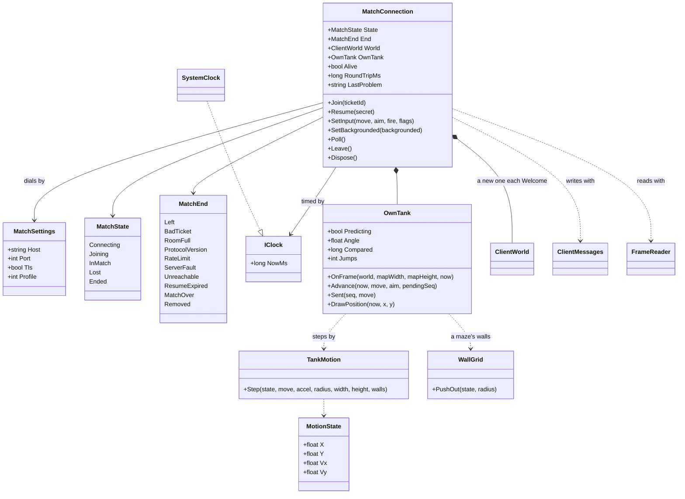

### 1.3 The lobby, the API and the account

`LobbyClient.cs`, `PartyState.cs`, `ApiClient.cs`, `AccountKeeper.cs` and
`Json.cs`. The lobby keeps what it was told; the API answers each call with an
`ApiResult`; the account keeper signs in by the key a secure store keeps.

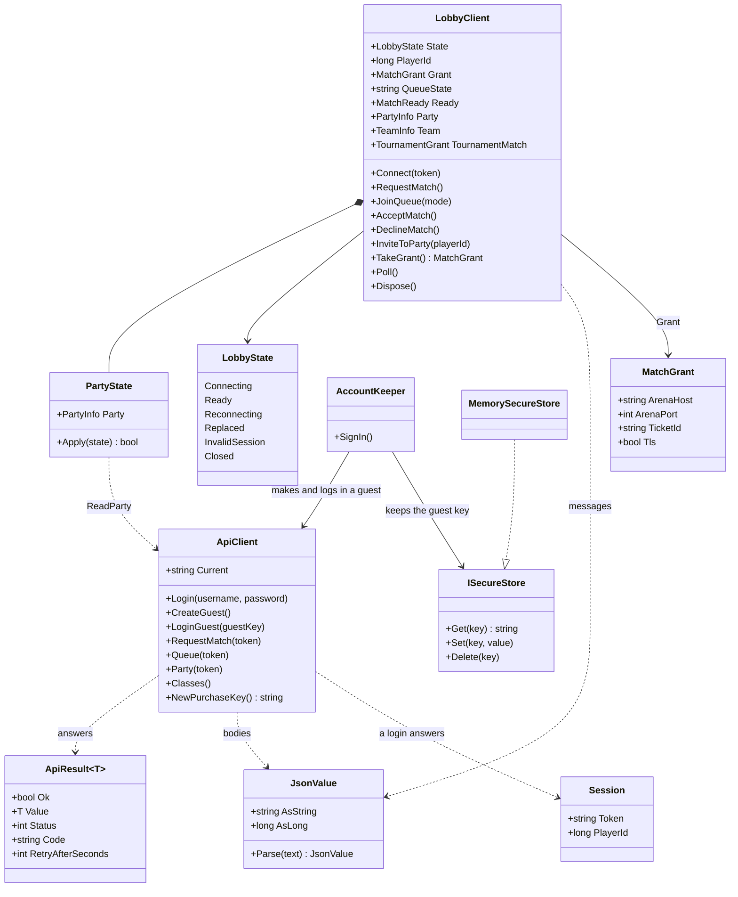

### 1.4 What a frame draws, and the sticks

`Scene.cs` and `TouchSticks.cs`. The layer above passes the render clock's tick
and the own tank's drawn position to `Scene.Build`; the sticks become the
arguments of `MatchConnection.SetInput`.

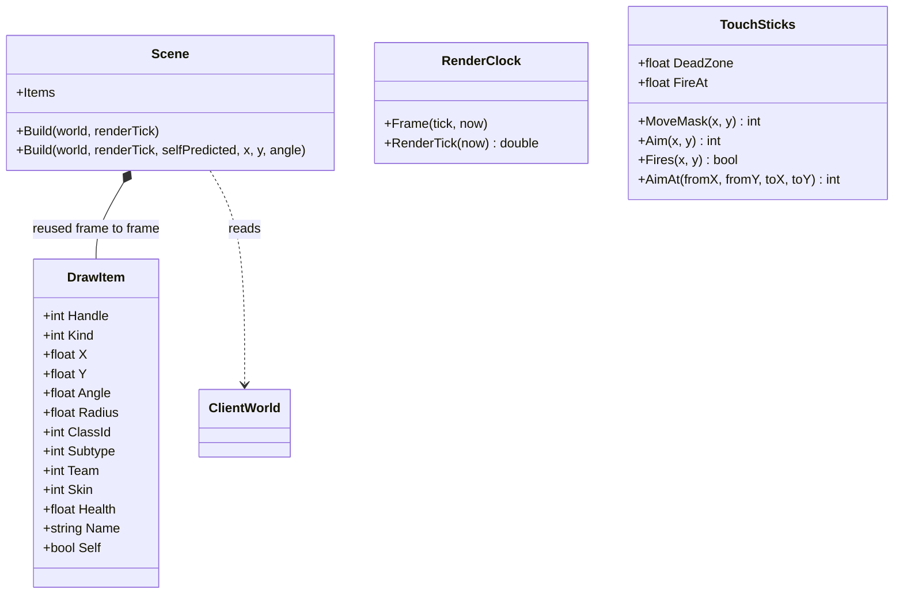

## 2. MatchConnection's lifecycle

`MatchConnection.Poll` moves the state; the receive thread only connects,
reads and queues ([08 §3](../detailed-design/08-client.md#3-the-match-connection)).
`End` says why it ended, and what follows is the layer above's.

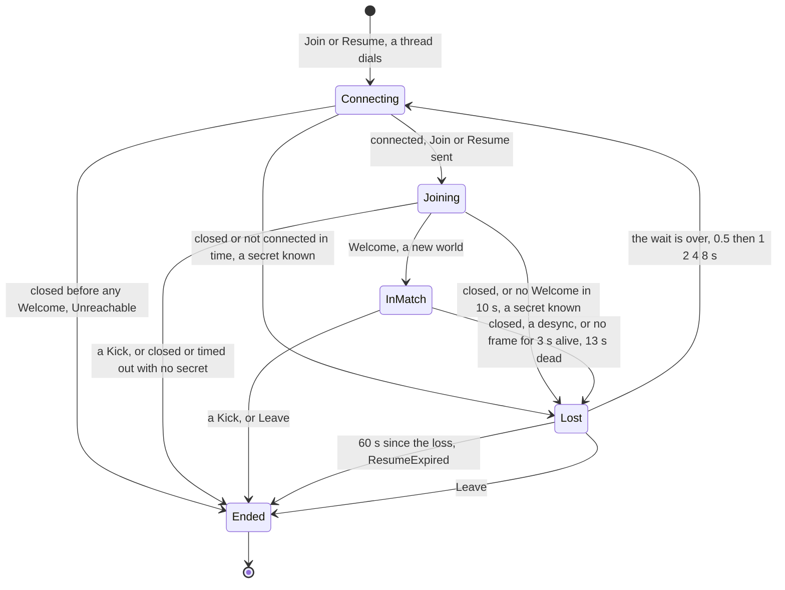

## 3. LobbyClient's lifecycle

`LobbyClient.Poll` moves the state; a reading task and a writing task serve the
socket ([08 §5](../detailed-design/08-client.md#5-the-lobby-and-the-api)). The
wait before each reconnect starts at 1 s, doubles to 30 s at most, is jittered
±50 %, and goes back to 1 s on `auth.ok`.

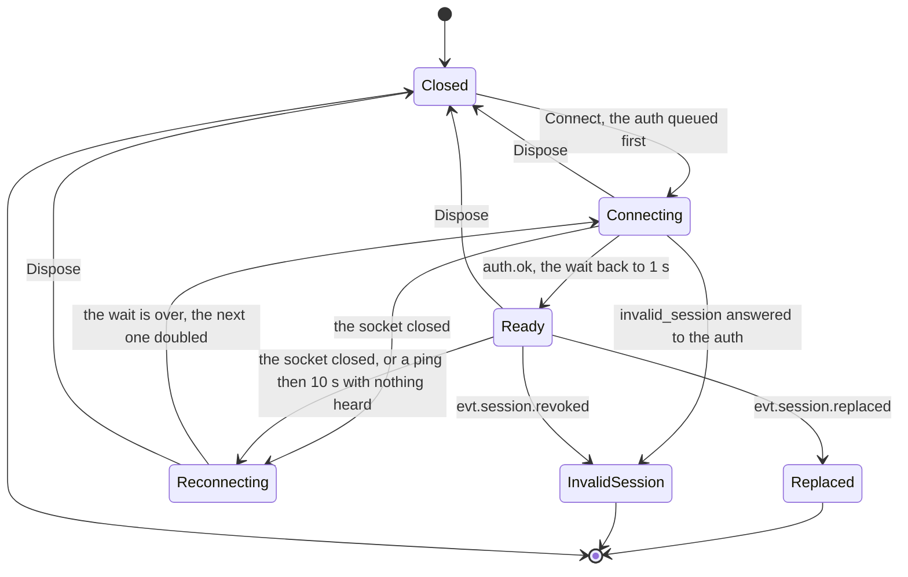

## 4. Join and resume, from the client's side

`MatchConnection` and its receive thread against an arena
([02 §10](../detailed-design/02-networking.md#10-session-reconnect-and-app-lifecycle)):
a join, the frames and inputs of a match, a lost connection resumed, and a
`Leave` that waits for the arena to close first.

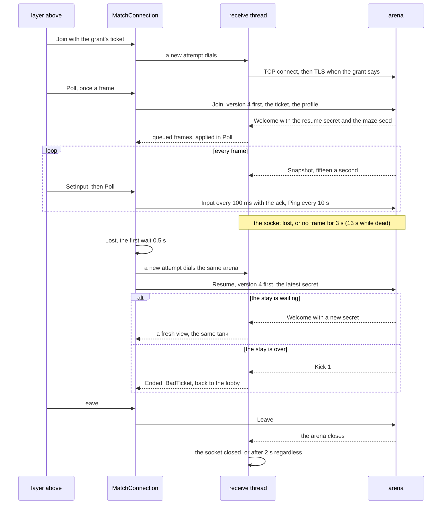

## 5. The own tank: prediction and reconciliation

`OwnTank`, stepped from `MatchConnection.Poll` and reconciled with each frame
([08 §4](../detailed-design/08-client.md#4-the-world-and-when-things-are-drawn),
D-62). `TankMotion.Step` is each step.

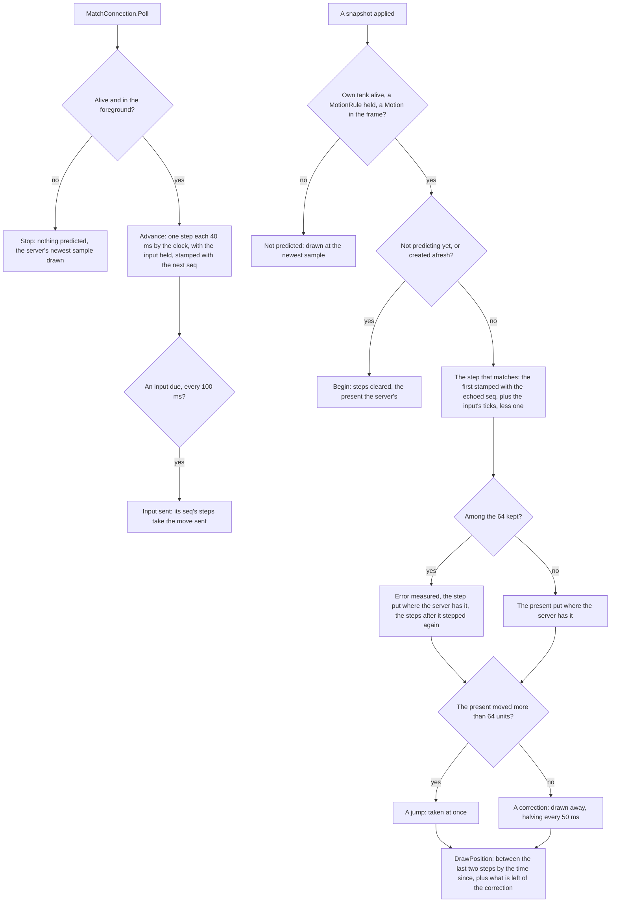

## 6. The render clock and the scene

`RenderClock` and `Scene`, called by the layer above once a frame
([08 §8](../detailed-design/08-client.md#8-the-unity-layer-as-scripts-designed-2026-10-04-plan-item-77)):
everything but the own tank is drawn a little in the past, between samples the
world already has.

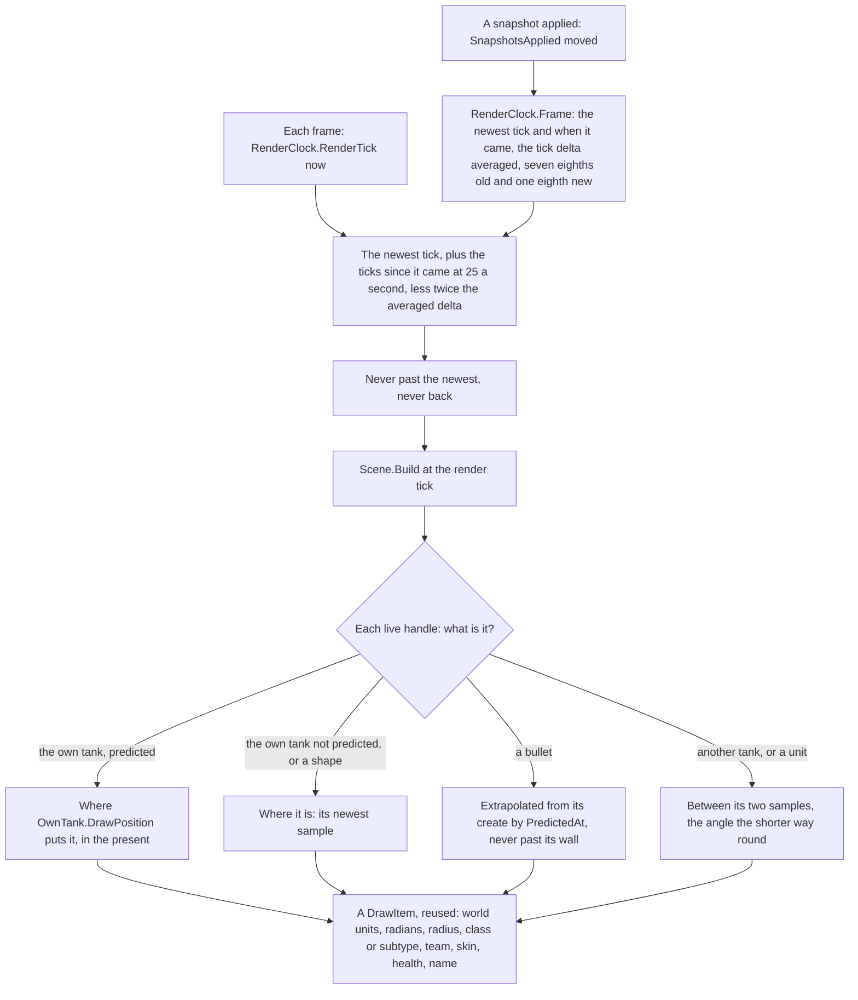

## 7. AccountKeeper's sign-in

`AccountKeeper.SignIn` over `ApiClient` and an `ISecureStore`
([08 §8](../detailed-design/08-client.md#8-the-unity-layer-as-scripts-designed-2026-10-04-plan-item-77)).
Its continuations stay on the caller's context, so in Unity the store is
touched on the main thread.

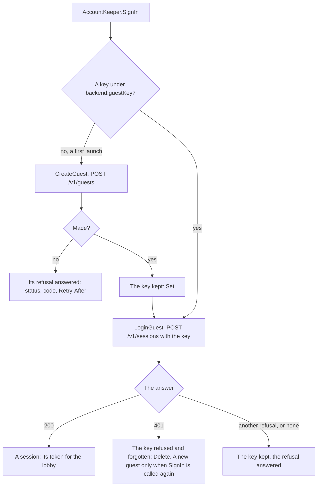

## 8. PartyState's rule

`PartyState.Apply`, called by `LobbyClient` for each party answer and each
`evt.party.update` (D-74): answers and pushes come by different paths, so a
state can arrive after a newer one.

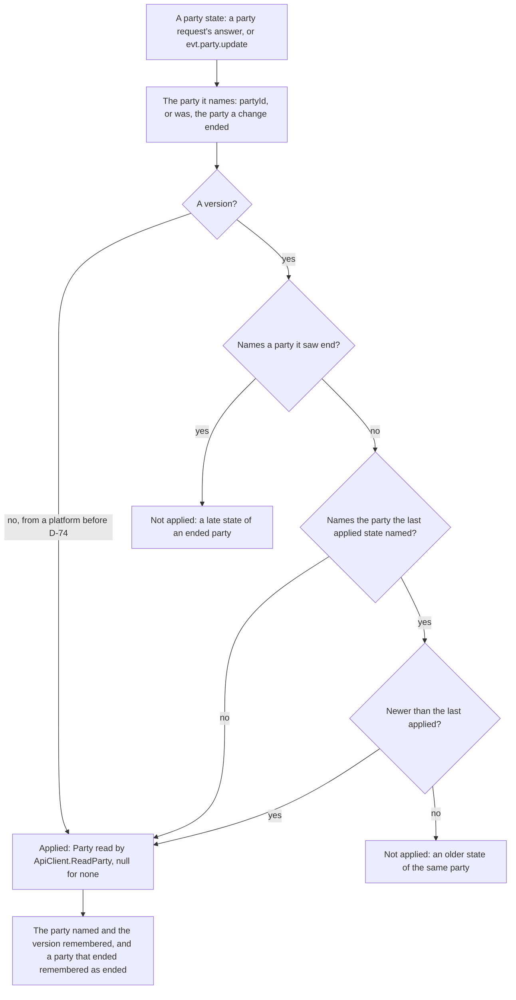

## 9. The Unity layer's wiring

The package's scripts over the core
([client/Unity/com.backend.client](../../client/Unity/com.backend.client/README.md)):
`BackendClient` owns the core's objects and pumps them in `Update`; the
others read what it built or feed it.

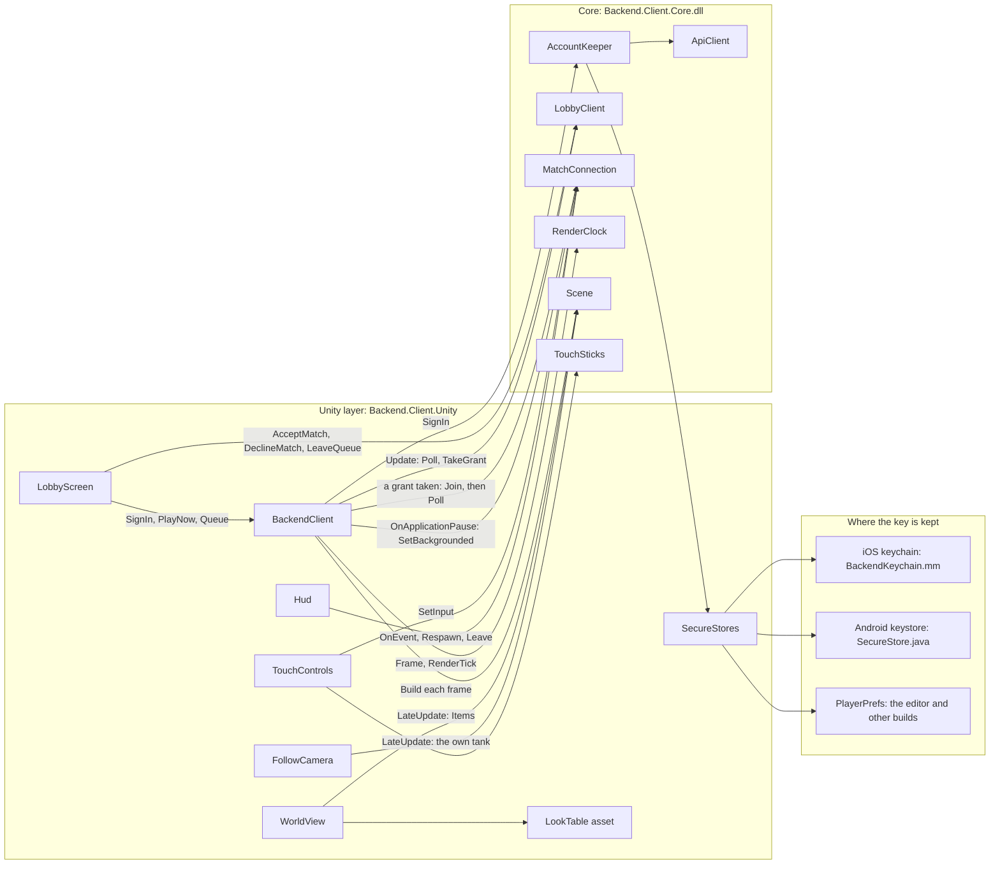
