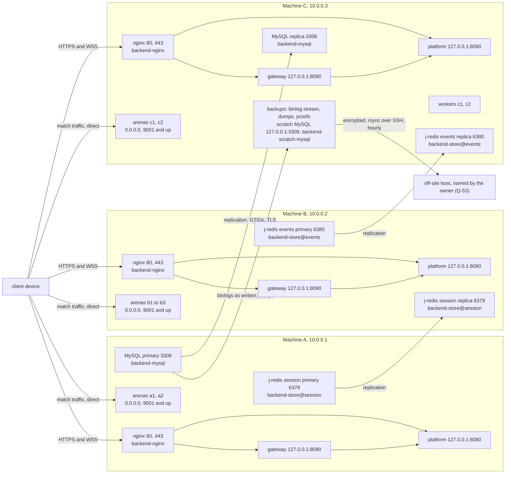
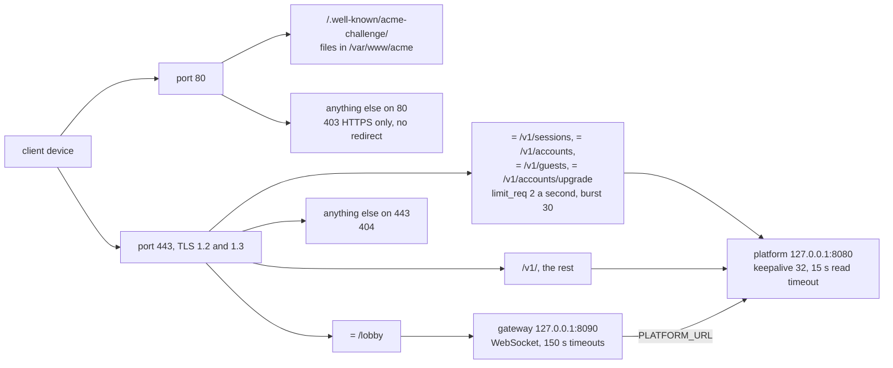
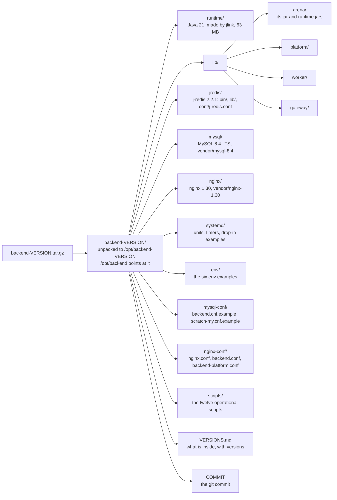
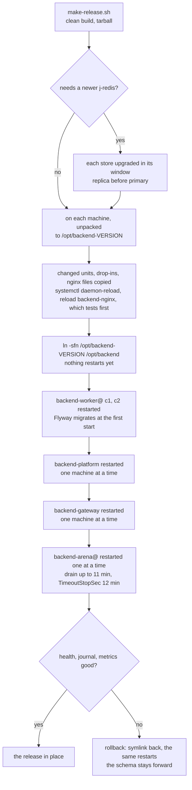
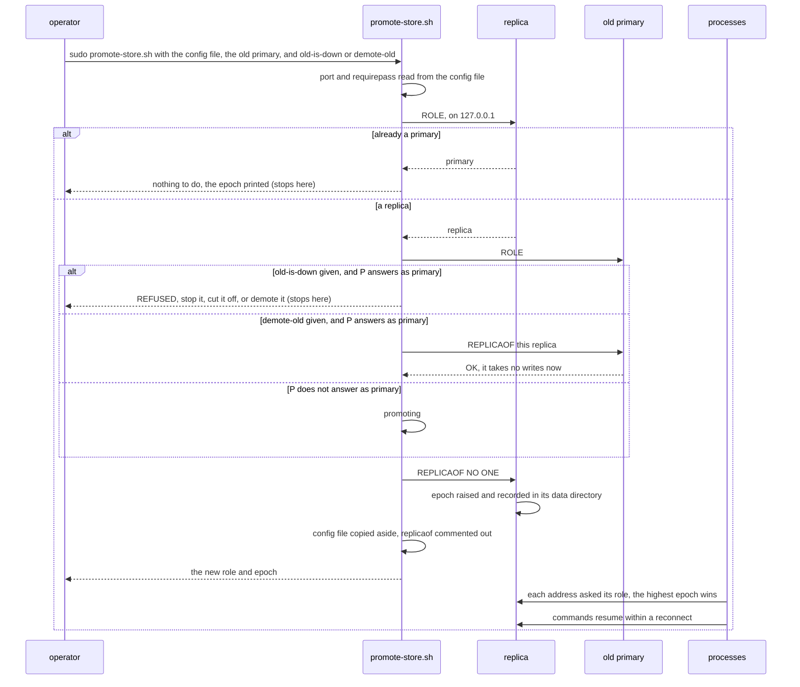
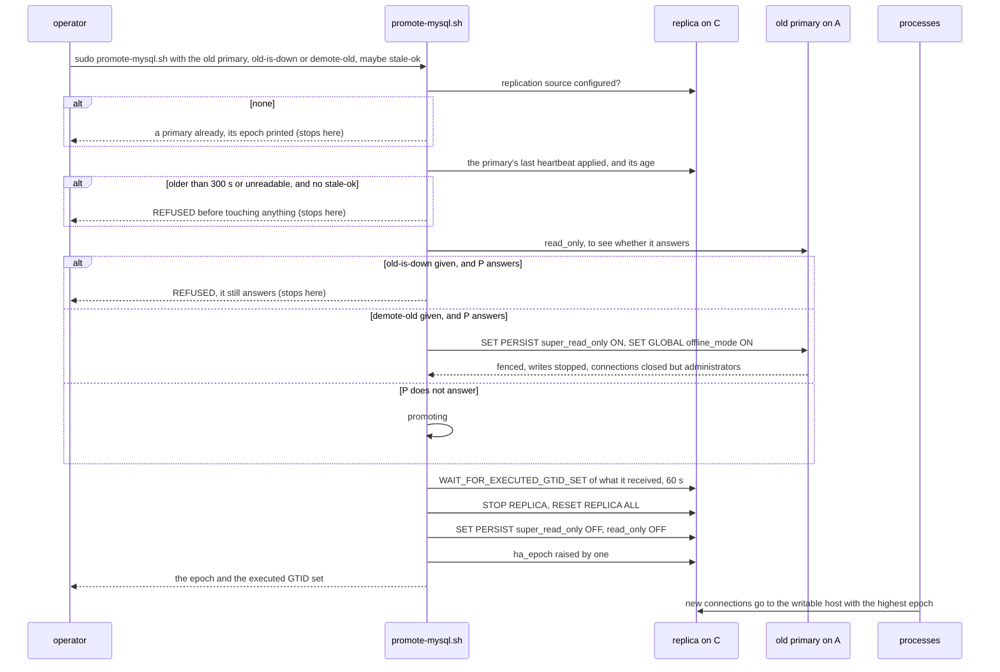
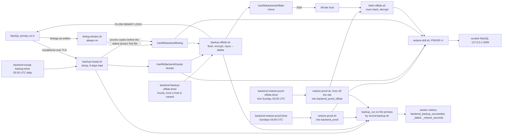
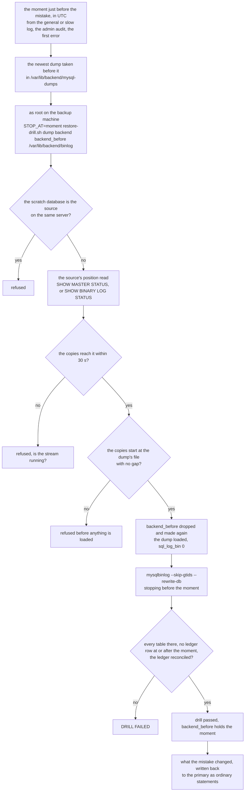

# 07 — Deployment and operations

How the backend is laid out on its three machines, what a release holds, and how the operations
that change it run: a rolling deploy, a store's failover, MySQL's failover, the backups with their
timers, and a restore to a moment. The text these pictures follow is
[operations/01-deploy](../operations/01-deploy.md) and the
[runbook](../operations/02-runbook.md); the files are described in
[deploy/README](../../backend/deploy/README.md) and
[scripts/README](../../backend/scripts/README.md), which also hold the catalogues of settings,
ports and timers.

## The three machines

What runs where, with the ports each listener takes, as
[01 §1](../operations/01-deploy.md#1-what-runs-where) and the `deploy/env/` examples set it. Every
process uses the `session` store's primary; the arenas and workers also use the `events` store's;
`platform` and `worker` use the MySQL primary. Each process is given both addresses of a store and
both MySQL hosts, so the replicas drawn here are where a failover moves those lines. nginx, MySQL
and the stores are the release's own, not the distribution's, each run by its unit from
`/opt/backend` (D-77, [09](../detailed-design/09-release-and-packaging.md)).

## nginx's routes

One nginx per machine, in front of that machine's gateway and platform only; match traffic never
passes it (D-5). From `deploy/nginx/backend.conf` and its snippet `backend-platform.conf`.

## The release

What `scripts/make-release.sh` builds, after j-redis and a clean build, and how it is installed
([deploy/README](../../backend/deploy/README.md#the-release)). Each process has a `lib/` of its
own, so the MySQL driver stays off the arena and the gateway. The release carries what the
processes run on too: a Java runtime linked from `vendor/jdk-21`, j-redis, and MySQL and nginx from
`vendor/` as committed ([09 §4](../detailed-design/09-release-and-packaging.md#4-the-release)).

## A rolling deploy

The order of [01 §5](../operations/01-deploy.md#5-rolling-deployment), from the least visible to
players to the most; no script drives it. Each restart is checked before the next: the platform's
`/health`, the journal, the metrics.

## A store's failover

`scripts/promote-store.sh`, run as root on the replica's machine
([runbook §2](../operations/02-runbook.md#a-j-redis-store-built-2026-09-29-d-34)). The clients
follow the highest epoch by themselves; the old primary's machine, when it is back, is made a
replica before it starts.

## MySQL's failover

`scripts/promote-mysql.sh`, run as root on the replica's machine, C
([runbook §2](../operations/02-runbook.md#mysql-built-2026-09-29-d-35)). It refuses before
touching anything when the replica's last heartbeat from the primary is stale, and never promotes
while the old primary may still serve.

## The backups

The backup machine's units and timers ([01 §10](../operations/01-deploy.md#10-copies-off-the-databases-machine)):
`backend-binlog-stream`, `backend-mysql-backup`, `backend-backup-offsite`,
`backend-restore-proof` and `backend-restore-proof-offsite`, each running its script from
`/opt/backend/scripts/`. Every step but the stream records its outcome in `backup_run`, which every
worker reports.

The two proofs never run at the same time. The binlog stream records nothing, so a stopped stream
shows only in the next copy off the site or the next proof; `systemctl status
backend-binlog-stream` is in the daily checks ([runbook §6](../operations/02-runbook.md#6-routine)).

## A restore to a moment

`scripts/restore-drill.sh` with `STOP_AT`, run by hand on the backup machine
([runbook](../operations/02-runbook.md#recovering-to-a-moment)): the copy is made on the scratch
server, never on the primary, and what the mistake changed is written back from it.

With no server holding the database left, the same script runs with `NO_SOURCE=1` from the copy
off the site, fetched back by `fetch-offsite.sh`
([runbook](../operations/02-runbook.md#a-last-resort-restore-with-no-source-left)).
